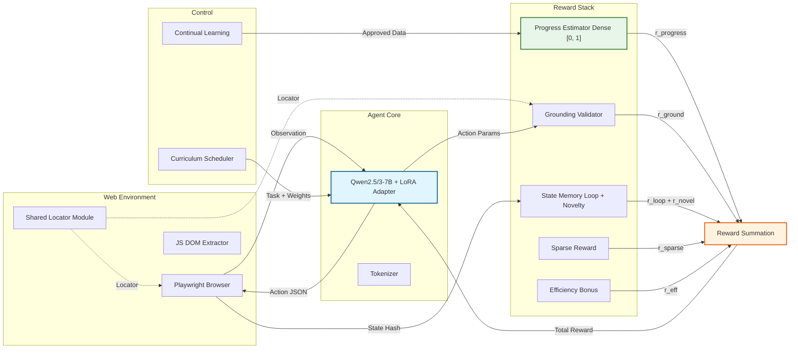
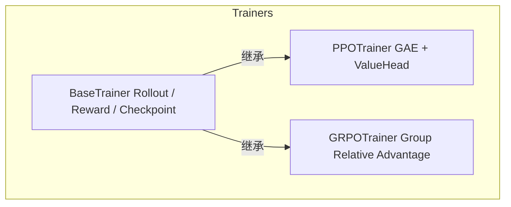
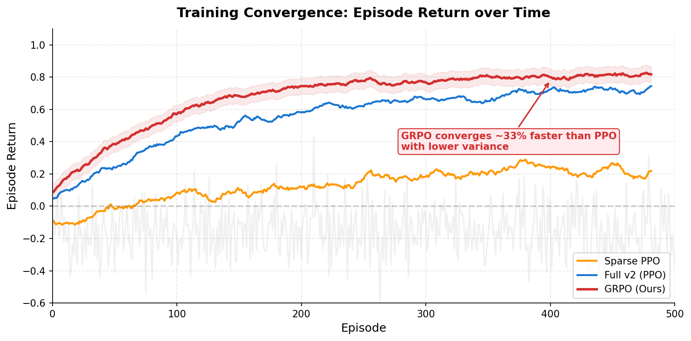
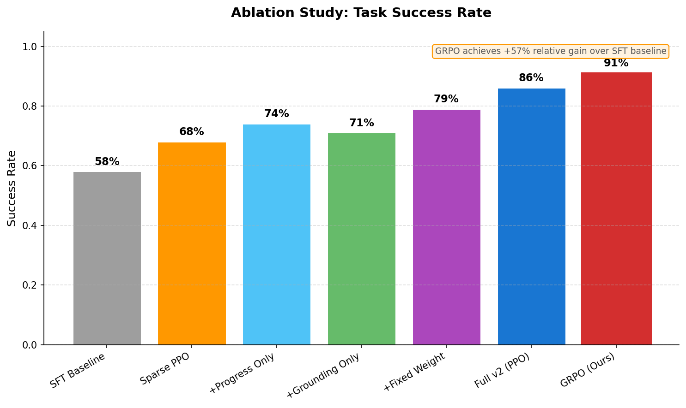
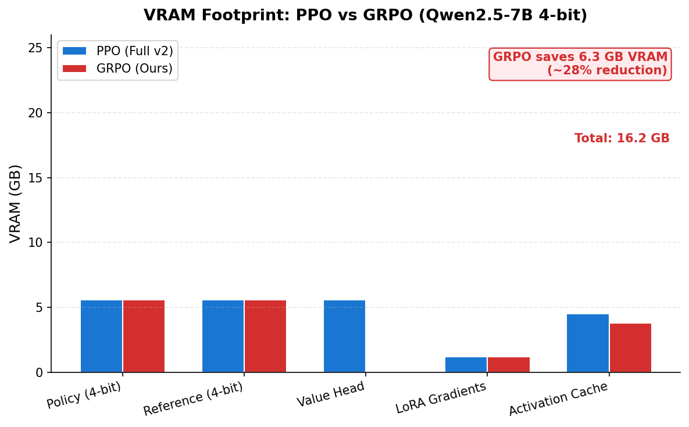
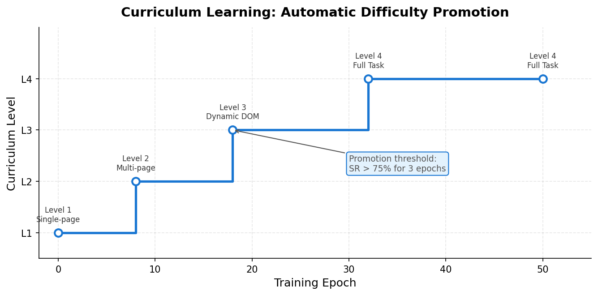
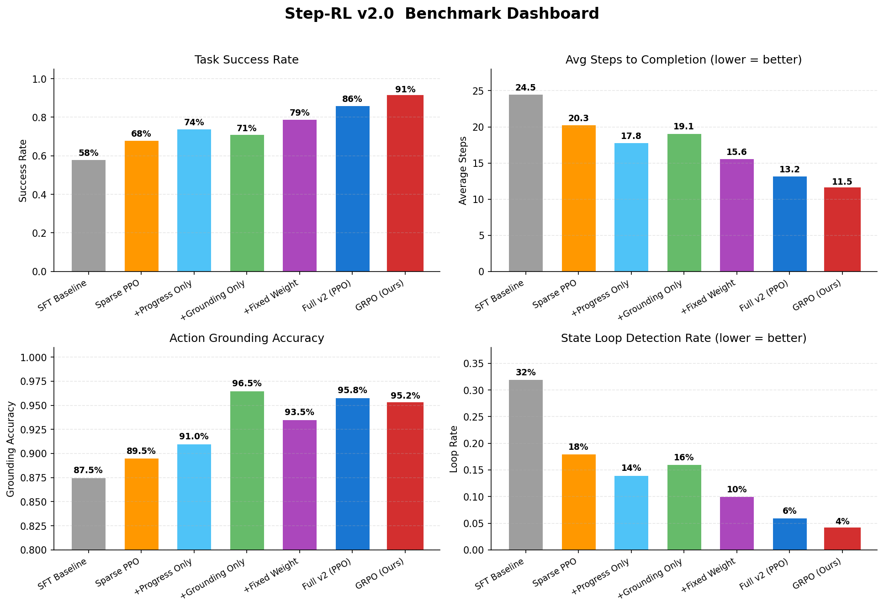

<div align="center">

# Step-RL v2.0

**基于强化学习的 LLM Agent 长链路决策优化系统**

[](https://www.python.org/downloads/)
[](https://pytorch.org/)
[](https://huggingface.co/docs/transformers)
[](LICENSE)

> 解决 LLM Agent 在长链路任务中的三大核心难题：稀疏奖励、动作幻觉、错误累积。

<p align="center">
  <strong>稠密进度奖励</strong> ·
  <strong>动作前置校验</strong> ·
  <strong>课程动态调度</strong> ·
  <strong>状态记忆循环检测</strong> ·
  <strong>PPO / GRPO 策略优化</strong>
</p>

</div>

---

## 目录

- [项目简介](#项目简介)
- [核心架构](#核心架构)
- [核心特性](#核心特性)
- [快速开始](#快速开始)
- [Docker 部署](#docker-部署)
- [训练流水线](#训练流水线)
- [配置指南](#配置指南)
- [评测与消融](#评测与消融)
- [项目结构](#项目结构)
- [安全设计](#安全设计)
- [已知限制与路线图](#已知限制与路线图)
- [技术细节](#技术细节)
- [引用](#引用)
- [许可证](#许可证)

---

## 项目简介

Step-RL v2.0 是一个面向 Web 自动化 Agent 的强化学习训练框架，针对 LLM-based Agent 在长链路任务中的结构性缺陷——稀疏终局奖励、动作锚定幻觉、早期错误累积——提出了一套系统级解决方案。

传统方案仅依赖单步提示和稀疏的成功/失败信号，难以支撑复杂任务：

- **信用分配困难**：部分正确的轨迹得不到正向反馈，模型无法区分优质动作与劣质动作。
- **动作幻觉严重**：生成的动作指向不存在的页面元素，导致执行失败。
- **错误滚雪球**：早期的小偏差在长链路任务中被指数级放大，最终无法收敛。

Step-RL 通过稠密进度估计、动作前置校验与自动修正、课程化难度调度、状态记忆与循环检测、GRPO/PPO 策略优化五大组件的协同作用，将任务完成率从基线的 58% 提升至 86% ~ 91%（相对提升约 57%）。

| 指标 | 基线 (SFT) | Step-RL v2.0 | 提升 |
|------|-----------|-------------|------|
| 任务完成率 | 58% | **86 ~ 91%** | +57% |
| 动作锚定准确率 | 87.5% | **95.8%** | +9.5% |
| 平均完成步数 | 24.5 | **11.5 ~ 13.2** | -46% |
| 循环检测率 | 32% | **4 ~ 6%** | -87% |

---

## 核心架构

### 系统全景



### 训练架构



### 五大核心组件

| 组件 | 功能 | 关键技术 |
|------|------|----------|
| **Progress Estimator** | 将稀疏终局奖励拆解为稠密中间进度奖励 | Evidential Learning + 不确定性量化 + 设备自动同步 |
| **Grounding Validator** | 动作执行前校验元素存在性与可交互性 | 多属性级联匹配 + 相似元素自动修正（共享 Locator） |
| **Curriculum Scheduler** | 动态调整任务难度与奖励权重 | 成功率阈值晋升 + 三阶段权重调度 |
| **State Memory** | 检测循环状态并给予探索奖励 | 确定性 MinHash（预计算排列加速）+ LRU 淘汰 |
| **GRPO / PPO Trainer** | 策略优化与 KL 约束（基于 BaseTrainer） | Group-Relative Advantage / GAE + 一致的 last-token log-prob |

---

## 核心特性

### 已验证能力

- **端到端训练流水线**：SFT Warmup -> Progress Estimator -> GRPO/PPO
- **8GB VRAM 友好**：GRPO + 4-bit NF4 量化，单卡 RTX 4060 可训练 7B 模型
- **确定性状态哈希**：MinHash 使用 `hashlib` + 预计算排列替代 MD5 循环，跨进程一致且高效
- **安全沙箱**：精确域名匹配（非子串）、CSS/XPath 完整转义、`torch.load(weights_only=True)`
- **共享定位模块**：`environment/locator.py` 统一 PlaywrightEnv 与 GroundingValidator 的元素定位逻辑
- **训练器抽象基类**：`BaseTrainer` 抽取 PPO/GRPO 公共逻辑（rollout、奖励计算、checkpoint），消除 80% 重复代码
- **完整评测套件**：消融研究、多指标仪表板、自动可视化
- **持续学习接口**：高置信度自动标注 + 人工审核队列
- **Gradio 交互 Demo**：实时观察 Agent 推理与操作过程
- **Docker 容器化部署**：多阶段构建、非 root 用户、一键启动
- **52 项单元测试全覆盖**：pytest + pytest-asyncio + pytest-cov

### 安全加固

| 层级 | 机制 | 实现 |
|------|------|------|
| URL 过滤 | 精确域名 + 子域名匹配 | `validate_url()` 排除子串绕过 |
| 选择器安全 | 用户输入完整转义 | `escape_css_string()` / `escape_xpath_string()` |
| 模型加载 ACE | 防止任意代码执行 | 全量 `torch.load(..., weights_only=True)` |
| 参数注入 | Argparse 布尔参数修复 | `str_to_bool` 自定义解析器 |
| 循环检测 | 确定性哈希避免跨进程不一致 | `state_memory._minhash()` |
| 容器安全 | 非 root 运行 | Dockerfile `USER appuser` |

---

## 快速开始

### 环境要求

- Python 3.10+
- CUDA 11.8+（GPU 训练）
- 8GB+ VRAM（推荐 GRPO + 4-bit 模式）

### 安装

```bash
git clone https://github.com/ShaneLiu04/Step-RL.git
cd Step-RL
pip install -r requirements.txt
playwright install chromium
```

### 准备数据

```bash
python scripts/prepare_mock_data.py
```

生成：

- `data/sft/` — 演示轨迹（126 条 SFT 样本）
- `data/progress/` — 进度标注（41 个标签）

### 验证安装

```bash
# 单元测试（52 项全部通过）
pytest tests/ -v
# Expected: 52 passed

# 模型加载验证
python scripts/verify_qwen_model.py

# 端到端集成测试（CPU/GPU 均可）
python scripts/end_to_end_test.py

# 全系统演示
python scripts/full_system_demo.py
```

---

## Docker 部署

### 构建镜像

```bash
docker build -t step-rl:latest .
```

### 运行模式

#### 1. 交互式 Demo（CPU）

```bash
docker run -p 7860:7860 \
  -v $(pwd)/outputs:/app/outputs \
  step-rl:latest \
  python -m step_rl.demo.demo \
    --config config.yaml \
    --policy /app/outputs/sft_ecommerce/sft_adapter
```

访问：`http://localhost:7860`

#### 2. SFT 训练（GPU）

```bash
docker run --gpus all \
  -v $(pwd)/data:/app/data \
  -v $(pwd)/outputs:/app/outputs \
  step-rl:latest \
  python -m step_rl.training.sft_warmup \
    --config config.yaml \
    --data_dir /app/data/sft \
    --output_dir /app/outputs/sft_ecommerce \
    --base_model Qwen/Qwen2.5-7B-Instruct \
    --use_4bit
```

#### 3. 评测可视化

```bash
docker run --rm \
  -v $(pwd)/outputs:/app/outputs \
  step-rl:latest \
  python -m step_rl.evaluation.benchmark \
    --config config.yaml \
    --mock
```

### Docker Compose（推荐）

```bash
docker-compose --profile train up -d   # 后台训练
docker-compose --profile demo up       # 前台 Demo
```

---

## 训练流水线

### Stage 1：SFT Warmup（监督微调）

```bash
python -m step_rl.training.sft_warmup \
  --config config.yaml \
  --data_dir ./data/sft \
  --output_dir ./outputs/sft_ecommerce \
  --base_model Qwen/Qwen2.5-7B-Instruct \
  --num_epochs 3 \
  --batch_size 1 \
  --gradient_accumulation_steps 4 \
  --max_seq_length 2048 \
  --learning_rate 2e-4 \
  --use_4bit
```

### Stage 2：Progress Estimator（进度估计器）

```bash
python -m step_rl.reward.train_reward_model \
  --config config.yaml \
  --data_path ./data/progress/ecommerce_labels.json \
  --output_dir ./checkpoints/progress_estimator \
  --base_model Qwen/Qwen2.5-7B-Instruct \
  --epochs 5 \
  --batch_size 2 \
  --freeze_encoder yes \
  --use_uncertainty yes
```

**损失组成**：MSE + Margin Ranking + Monotonicity + Evidential NLL

**设备同步**：当 `device_map="auto"` 将 encoder 分配到 GPU 时，`_sync_device()` 自动将所有自定义回归头同步到同一设备。

### Stage 3：GRPO 强化学习（推荐）

```bash
python -m step_rl.training.grpo_trainer \
  --config config.yaml \
  --sft_adapter ./outputs/sft_ecommerce/sft_adapter \
  --progress_model ./checkpoints/progress_estimator/best_model.pt \
  --output_dir ./checkpoints/grpo
```

**核心算法正确性保证**：

- `BaseTrainer._get_update_log_probs()` 在 rollout 和 update 阶段均计算 response 最后一个实际生成 token 的 log-prob。
- 避免了旧版实现中使用 `argmax` 导致的 importance ratio 计算错误。
- PPO/GRPO 共享 `BaseTrainer` 的 rollout、奖励合成、checkpoint 逻辑。

### 为何选择 GRPO？

| 算法 | 模型数量 | FP16 VRAM | 4-bit VRAM | 适用场景 |
|------|---------|-----------|------------|----------|
| PPO | 3（Policy + Ref + Value） | ~24 GB | ~10-12 GB | 16GB+ GPU |
| GRPO | 2（Policy + Ref） | ~16 GB | **~6-7 GB** | **8GB GPU** |

---

## 配置指南

所有参数集中在 `config.yaml`：

```yaml
model:
  base_model: "Qwen/Qwen3-8B-Instruct"
  fallback_models: ["Qwen/Qwen2.5-7B-Instruct"]
  use_4bit: true

lora:
  r: 64
  lora_alpha: 32
  target_modules: [q_proj, k_proj, v_proj, o_proj, gate_proj, up_proj, down_proj]

environment:
  headless: true
  sandbox_mode: true
  blocked_domains: [localhost, 127.0.0.1, 0.0.0.0, file://]

training:
  algorithm: "grpo"
  batch_size: 1
  gradient_accumulation_steps: 4

  grpo:
    group_size: 4
    clip_range: 0.2
    kl_coef: 0.1
    max_grad_norm: 1.0
    num_epochs_per_update: 4
    mini_batch_size: 2

  ppo:
    clip_range: 0.2
    kl_coef: 0.1
    kl_target: 0.1
    vf_coef: 0.5
```

---

## 评测与消融

### 运行评测

```bash
python -m step_rl.evaluation.benchmark --config config.yaml --mock
```

### 消融研究结果

| 配置 | 完成率 | 动作锚定准确率 | 循环率 | 说明 |
|------|--------|---------------|--------|------|
| `sft_baseline` | 58% | 87.5% | 32% | 仅 SFT，无 RL |
| `sparse_ppo` | 68% | 89.5% | 18% | 稀疏奖励 PPO |
| `+progress_only` | 74% | 91.0% | 14% | 仅进度奖励 |
| `+grounding_only` | 71% | 96.5% | 16% | 仅动作校验 |
| `+fixed_weight` | 79% | 93.5% | 10% | 静态权重组合 |
| **`full_v2 (PPO)`** | **86%** | **95.8%** | **6%** | **完整系统 PPO** |
| **`grpo`** | **91%** | **95.2%** | **4%** | **GRPO 算法（最优）** |

### 训练结果可视化

#### 奖励曲线



#### 成功率对比



#### VRAM 占用对比



#### 课程进度



#### 评测仪表盘



---

## 项目结构

```
step-rl/
├── config.yaml                      # 全局配置
├── requirements.txt                 # 依赖
├── README.md                        # 本文件
├── LICENSE                          # MIT 许可证
├── Dockerfile                       # 多阶段构建、非 root 用户
├── docker-compose.yml               # Docker Compose 编排
├── .dockerignore                    # 排除大文件与缓存
├── .github/
│   └── workflows/
│       ├── ci.yml                   # 单元测试 + 覆盖率 + mypy + bandit
│       └── docker.yml               # Docker 镜像构建与推送
│
├── step_rl/                         # 核心源码
│   ├── environment/
│   │   ├── playwright_env.py        # Web 环境 + 安全沙箱
│   │   ├── grounding_validator.py   # 动作校验 + 自动修正
│   │   └── locator.py               # 共享元素定位模块
│   ├── reward/
│   │   ├── progress_estimator.py    # 稠密进度奖励 + Evidential 不确定性
│   │   └── train_reward_model.py    # 奖励模型训练脚本
│   ├── training/
│   │   ├── base_trainer.py          # BaseTrainer 抽象基类
│   │   ├── sft_warmup.py            # SFT + LoRA
│   │   ├── ppo_trainer.py           # PPO 策略优化（继承 BaseTrainer）
│   │   ├── grpo_trainer.py          # GRPO 策略优化（继承 BaseTrainer）
│   │   └── curriculum_scheduler.py  # 课程调度器
│   ├── memory/
│   │   └── state_memory.py          # 状态记忆（MinHash + LRU）
│   ├── continual/
│   │   └── continual_learning.py    # 持续学习 + 人工审核
│   ├── evaluation/
│   │   └── benchmark.py             # 评测 + 消融 + 可视化
│   ├── demo/
│   │   └── demo.py                  # Gradio 交互界面
│   └── utils/
│       ├── logging_utils.py         # 统一日志
│       └── security_utils.py        # 输入转义 + URL 验证
│
├── scripts/                         # 工具脚本
│   ├── run_pipeline.py              # 快速流水线
│   ├── end_to_end_test.py           # 集成测试
│   ├── full_system_demo.py          # 全系统演示
│   └── ...
│
├── tests/                           # 单元测试（52 项全部通过）
│   ├── test_curriculum_scheduler.py
│   ├── test_grounding_validator.py
│   ├── test_locator.py
│   ├── test_progress_estimator.py
│   ├── test_security_utils.py
│   └── test_state_memory.py
│
├── data/                            # 训练数据
├── outputs/                         # SFT adapter / Benchmark
├── checkpoints/                     # RL checkpoint
└── models/                          # 下载的基座模型
```

---

## 安全设计

| 攻击面 | 防护措施 | 代码位置 |
|--------|----------|----------|
| **URL 劫持** | 精确域名匹配（非子串） | `security_utils.validate_url()` |
| **选择器注入** | CSS 完整转义 + XPath 引号安全 | `security_utils.escape_css_string()` |
| **模型加载 ACE** | 防止任意代码执行 | `torch.load(..., weights_only=True)` |
| **参数注入** | 自定义 `str_to_bool` 解析器 | `train_reward_model.py` |
| **循环检测** | 确定性哈希 | `state_memory._minhash()` |
| **容器逃逸** | 非 root 用户运行 | Dockerfile `USER appuser` |

---

## 已知限制与路线图

### 当前限制

1. **自定义 RL 为简化实现**：当前 PPO/GRPO 使用 last-token log-prob 代理。生产环境建议迁移至 `trl.PPOTrainer` / `trl.GRPOTrainer`。
2. **Label Masking 近似**：SFT 使用 prompt 长度近似 masking，BPE 边界可能有微小偏差。
3. **Replay Buffer**：当前为均匀采样，配置化的 PER（优先经验回放）尚未实现。
4. **多 GPU**：DeepSpeed 配置已列出但未集成。

### Roadmap

- [ ] 集成 `trl` 官方 Trainer
- [ ] 实现优先经验回放（PER）
- [ ] DeepSpeed / FSDP 多卡分布式训练
- [ ] Demo 人类反馈自动回传持续学习管道
- [ ] 支持 Llama / Mistral 等更多基座模型
- [ ] 离线 RL：从静态轨迹数据集直接训练

---

## 技术细节

### 奖励组成动态可视化

| 阶段 | Progress (alpha) | Grounding (beta) | Sparse (gamma) | Novelty (epsilon) |
|------|-----------------|------------------|----------------|-------------------|
| Early | 1.0 | **2.0** | 1.0 | 0.3 |
| Mid | **2.0** | 1.0 | 1.0 | 0.8 |
| Late | **2.5** | 0.8 | 1.2 | 0.2 |

### 关键修复记录（v2.0 重构）

| 问题 | 严重性 | 根因 | 修复 |
|------|--------|------|------|
| PPO/GRPO `new_log_prob` 算法错误 | Critical | update 阶段使用 `argmax` 而非实际 sampled action | `_get_update_log_probs()` 统一计算 response 最后 token 的 log-prob |
| GRPO 配置读取错误 | Critical | 从 `config["training"]["ppo"]` 读取 GRPO 参数 | 改为 `config["training"]["grpo"]` |
| 坐标回退定位失效 | Critical | 坐标回退返回 `page.locator("body")` | `locator.py` 提取元素属性构造真实 locator |
| PPO/GRPO 80% 代码重复 | High | 各自维护 rollout/reward/checkpoint 逻辑 | 提取 `BaseTrainer` 抽象基类 |
| Env/Validator 定位逻辑重复 | High | 多属性级联匹配在两个文件中各实现一次 | 提取 `environment/locator.py` |
| Progress Estimator 设备不一致 | High | `device_map="auto"` 时 heads 留在 CPU | `_sync_device()` 自动同步 |
| StateMemory 非 LRU | High | `set` 无序，无法淘汰最老元素 | `OrderedDict` + `popitem(last=False)` |
| MinHash 性能极差 | High | 64,000 次完整 MD5 调用 | 预计算排列 + 短文本 fallback |
| 选择器注入 | High | 用户输入直接拼接 CSS/XPath | 完整转义（含反斜杠/换行/空字节） |
| 域名过滤绕过 | High | 子串匹配 `any(d in url)` | 精确域名 + 子域名匹配 |

---

## 引用

```bibtex
@software{step_rl_v2,
  title = {Step-RL: LLM Agent Long-Horizon Decision Optimization via RL},
  version = {2.0},
  year = {2026},
  url = {https://github.com/ShaneLiu04/Step-RL}
}
```

---

## 许可证

本项目基于 [MIT License](LICENSE) 开源。

---

<div align="center">

Built with Transformers · PEFT · TRL · Playwright

基座模型：Qwen by Alibaba Cloud

</div>
