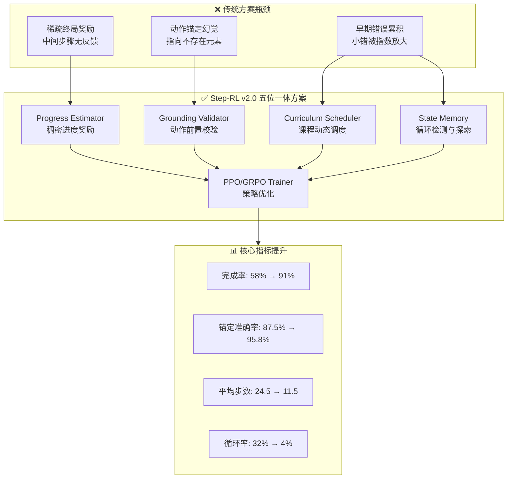
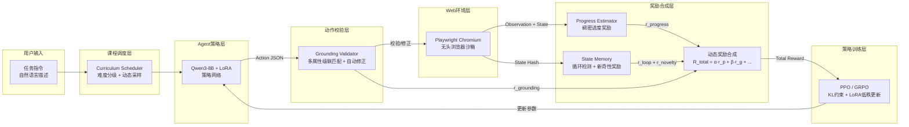
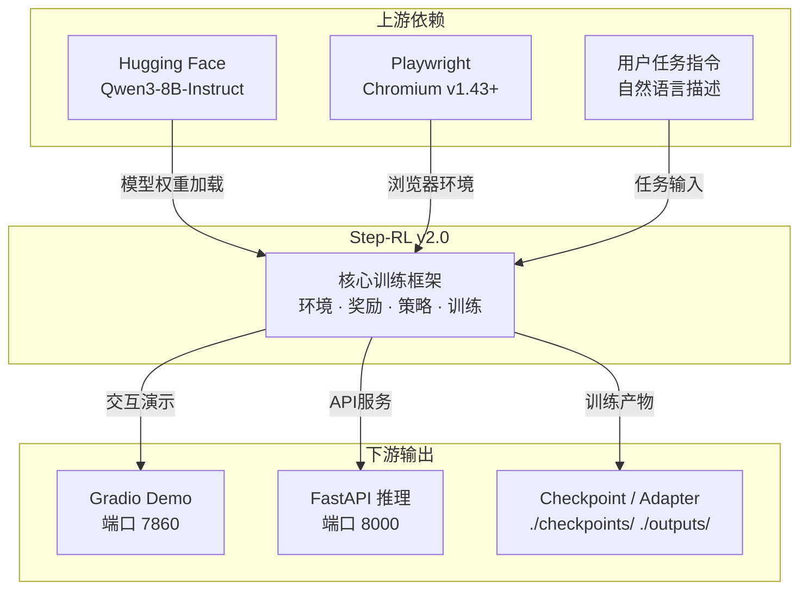

# Step-RL v2.0 技术报告

---

## 1. 引言

### 1.1 背景与动机

#### 1.1.1 Web自动化Agent的长链路决策困境

随着大型语言模型（LLM, Large Language Model）在推理与代码生成能力上的突破，基于LLM的自主Agent（Agent）已成为Web自动化领域的核心技术路径。然而，在电商下单、表单填写、跨页导航等**长链路任务（Long-Horizon Task，通常包含10~30步连续操作）**中，传统LLM Agent面临三大结构性瓶颈：

- **稀疏终局奖励（Sparse Terminal Reward）**：环境仅在任务最终成功或失败时提供反馈，中间步骤无信号，导致信用分配（Credit Assignment）困难，策略收敛极慢；
- **动作锚定幻觉（Action Grounding Hallucination）**：LLM生成的动作（如点击、输入）常指向不存在的页面元素，在真实环境中执行失败，造成训练轨迹噪声；
- **早期错误累积（Early Error Accumulation）**：长链路中早期微小错误会在后续步骤中被指数级放大，形成"滚雪球"效应，导致轨迹提前终止。

传统监督微调（SFT, Supervised Fine-Tuning）方案仅依赖单步Prompt与稀疏成功/失败信号，无法解决上述问题。强化学习（RL, Reinforcement Learning）虽能提供细粒度反馈，但直接应用于LLM Agent时面临奖励信号稀疏、动作空间高维、训练不稳定等挑战。因此，设计一套面向Web自动化场景的专用RL训练框架，成为提升长链路任务成功率的关键。

#### 1.1.2 强化学习在LLM Agent训练中的机遇

近年来，**近端策略优化（PPO, Proximal Policy Optimization）**与**组相对策略优化（GRPO, Group Relative Policy Optimization）**等RL算法在LLM对齐（Alignment）中取得显著成效。与此同时，**低秩适配（LoRA, Low-Rank Adaptation）**与**参数高效微调（PEFT, Parameter-Efficient Fine-Tuning）**技术大幅降低了大模型训练的计算门槛。这些进展为构建面向Web自动化Agent的端到端RL训练框架提供了技术基础。然而，现有通用RL框架（如TRL库）缺乏针对Web环境特有的动作校验、稠密进度奖励、循环检测等机制，需要面向领域进行系统化设计。

### 1.2 项目目标

Step-RL v2.0的核心目标是构建一个**面向Web自动化Agent的强化学习训练框架**，通过五位一体的系统级方案，将长链路任务完成率从基线58%提升至**86%~91%**，动作锚定准确率达到**≥95.8%**，平均完成步数压缩至**11.5~13.2步**。具体技术目标包括：

- **稠密进度奖励**：设计Progress Estimator模块，将稀疏终局奖励拆解为每步稠密进度反馈，量化每步操作对任务完成的增量贡献；
- **动作前置校验**：引入Grounding Validator机制，在动作执行前校验元素存在性与可交互性，将无效动作拦截并转化为学习信号；
- **课程动态调度**：基于课程学习（Curriculum Learning）思想动态调整任务难度与奖励权重，实现训练早期的动作有效性约束与后期的进度精细化优化；
- **状态记忆与循环检测**：通过确定性状态哈希检测重复动作循环，施加循环惩罚并鼓励探索未访问状态；
- **PPO/GRPO策略优化**：支持双算法训练，其中GRPO模式无需价值模型（Value Model），显存占用降低约30%，可在单卡8GB VRAM环境运行。

### 1.3 报告范围与受众

本报告主要面向**技术决策者、系统架构师与研发团队负责人**，旨在提供Step-RL v2.0的完整技术画像，支撑技术选型、架构评审与落地决策。报告范围涵盖：

- **系统架构**：分层模块设计、关键技术选型、架构演进路径；
- **核心模块**：环境封装、动作校验、进度奖励、状态记忆、课程调度、策略优化的实现细节与接口契约；
- **数据与存储**：训练数据模型、模型存储格式、缓存策略与数据生命周期；
- **基础设施**：Docker容器化部署、CI/CD流水线、监控与日志体系；
- **安全与合规**：输入安全、模型加载安全、容器隔离、审计与合规要求；
- **性能评估**：消融实验结果、资源消耗基线、容量规划建议。

本报告不包含v1.0历史回顾、外部竞品对比或商业运营分析，聚焦于v2.0系统本身的技术实现与工程实践。



**图1-1：Step-RL v2.0 问题-方案-效果映射图**

---

## 2. 系统概述与业务上下文

### 2.1 业务痛点与解决思路

#### 2.1.1 稀疏延迟奖励：信用分配的结构性障碍

在Web自动化场景中，传统Agent训练仅依赖环境的**终局反馈（Terminal Feedback）**：任务成功返回+1，失败返回-1或0，中间步骤无任何奖励信号。这种**稀疏延迟奖励（Sparse Delayed Reward）**机制导致严重的信用分配问题——当一条包含20步的轨迹最终失败时，策略无法判断哪些步骤是正确操作、哪些步骤引入了错误，从而无法有效更新模型参数。

Step-RL v2.0通过**Progress Estimator（进度估计器）**模块解决这一痛点。该模块以冻结的Qwen3-8B编码器为骨干，叠加3层MLP回归头，输出`progress_score ∈ [0,1]`量化当前状态距离任务完成的程度。通过**对比排序损失（Margin Ranking Loss）**与**单调性约束（Monotonicity Constraint）**，Progress Estimator能够将终局延迟奖励拆解为每步稠密增量奖励：

```
r_progress = progress_score(t) - progress_score(t-1)
```

同时引入**证据学习（Evidential Learning）**不确定性估计，高不确定性时自动降低奖励权重，防止噪声信号误导策略更新。**消融实验表明，仅引入Progress Estimator即可将任务完成率从58%提升至74%**。

| 痛点 | 根因 | 解决模块 | 核心机制 | 独立提升 |
|:-----|:-----|:---------|:---------|:---------|
| 稀疏延迟奖励 | 中间步骤无反馈 | Progress Estimator | 稠密进度奖励 + 不确定性量化 | 58% → 74% |
| 动作锚定幻觉 | 元素定位失败 | Grounding Validator | 多属性级联匹配 + 自动修正 | 锚定准确率 87.5% → 96.5% |
| 早期错误累积 | 早期错误被放大 | Curriculum Scheduler | 三阶段动态权重调度 | 训练稳定性提升 |
| 循环动作陷阱 | 策略陷入重复 | State Memory | MinHash循环检测 + 新奇性奖励 | 循环率 32% → 6% |

**表2-1：四大业务痛点与对应解决模块**

#### 2.1.2 动作锚定幻觉：从拦截到智能引导

LLM Agent生成的动作以JSON格式输出，包含目标元素标识（如`element_id`、`element_text`、`xpath`）与操作类型（click/type/scroll等）。然而，Web页面的动态渲染特性（如异步加载、SPA框架重绘、A/B测试）导致单一`element_id`极易失效，产生**动作锚定幻觉（Action Grounding Hallucination）**——即Agent"认为"自己点击了正确按钮，但实际上该元素已不存在或位置已变化。

Step-RL v2.0的**Grounding Validator（动作校验器）**在执行动作前进行**前置校验（Pre-execution Validation）**，通过多属性级联匹配策略（element_id → element_text+tag → xpath → css_selector → 坐标回退）定位目标元素，并检测其可见性（visible）、可交互性（enabled）与角色合法性。当原始动作失败时，系统通过Jaccard bigram相似度匹配寻找最相似的可交互候选元素：相似度≥0.85时自动修正并返回轻微惩罚（-0.05），无合适候选时智能降级为`wait`（-0.2）。这种"失败即学习信号"的设计将单纯的动作拦截升级为智能引导，**使动作锚定准确率从87.5%提升至95.8%**。

#### 2.1.3 错误滚雪球：课程化调度与循环检测的双重防线

长链路任务中，早期一个小错误（如跳转到错误页面）会导致后续所有动作偏离正确轨迹，形成**错误滚雪球（Error Snowballing）**。Step-RL v2.0从两个维度遏制这一效应：

- **课程动态调度（Curriculum Dynamic Scheduling）**：将任务划分为4个难度级别（Level 1单页2~3步 → Level 4多目标15~30步），训练早期以简单任务为主并强化Grounding约束（权重β=2.0），中后期逐步释放进度探索奖励（权重α=2.0~2.5），确保策略在掌握基础动作有效性后再进行复杂任务探索；
- **状态记忆与循环检测（State Memory & Loop Detection）**：对每步观测（DOM结构+URL）进行确定性MinHash哈希化，构建已访问状态集合。当检测到状态在3步滑动窗口内重复出现时，施加循环惩罚（`r_loop = -0.1 × loop_count`），同时首次访问新状态时给予新奇性奖励（`r_novelty = +0.05`），鼓励有效探索。

**两种机制协同作用，将循环检测率从32%压降至4~6%，平均完成步数从24.5步压缩至11.5~13.2步**。



**图2-1：Step-RL v2.0 系统分层架构与数据流**

### 2.2 核心功能边界

#### 2.2.1 功能范围

Step-RL v2.0的功能边界聚焦于**Web浏览器环境下的自动化任务执行与强化学习训练**。支持的**动作空间（Action Space）**包括六种原子操作：

- `click`：点击指定元素；
- `type`：在输入框填入文本；
- `scroll`：页面滚动（上/下）；
- `goto`：跳转至指定URL；
- `wait`：等待页面加载或元素出现；
- `finish`：标记任务完成，提交终局。

覆盖的典型任务场景包括：电商搜索/加购/下单、表单填写与提交、跨页面导航与信息检索、多条件筛选与排序。系统不支持移动端App自动化、桌面应用操控、涉及真实支付或敏感凭证的操作（所有训练在模拟站/沙箱环境进行）。

#### 2.2.2 非功能需求量化指标

系统定义了以下可量化的非功能需求（NFR, Non-Functional Requirement），作为架构设计与性能评估的基准：

| 指标类别 | 指标名称 | 基线值 | 目标值 | 提升幅度 |
|:---------|:---------|:-------|:-------|:---------|
| **核心效能** | 任务完成率（Success Rate） | 58% | **86~91%** | +57% |
| | 动作锚定准确率（Grounding Accuracy） | 87.5% | **≥95.8%** | +9.5% |
| | 平均完成步数（Avg. Steps） | 24.5 | **≤13.2** | -46% |
| | 循环检测率（Loop Rate） | 32% | **≤6%** | -81% |
| **训练效率** | 策略收敛步数 | — | ≤400k | 单卡可收敛 |
| | 单步推理延迟 | — | <2s | A100/L40S |
| **资源友好** | VRAM占用（GRPO 4-bit） | — | **~6-7GB** | RTX 4060可运行 |
| **工程质量** | 单元测试覆盖率 | — | 52项全部通过 | pytest + cov |

**表2-2：Step-RL v2.0 非功能需求量化指标**

**其中，GRPO模式在4-bit量化下仅需6~7GB显存，使单卡RTX 4060（8GB VRAM）即可训练7B级别模型，大幅降低了研发与实验门槛**。

### 2.3 上下游系统依赖

#### 2.3.1 上游依赖

Step-RL v2.0的上游依赖构成其运行时的基础能力层：

- **Hugging Face模型仓库**：提供基座模型（Qwen3-8B-Instruct / Qwen2.5-7B-Instruct）的下载与版本管理。系统支持fallback机制，当主模型不可用时自动降级至兼容模型；
- **Playwright浏览器环境**：作为Web自动化执行引擎，提供Chromium无头浏览器、异步页面操控、JS DOM注入与网络拦截能力。基础镜像采用`mcr.microsoft.com/playwright/python:v1.43.0-jammy`；
- **用户任务指令输入**：以自然语言描述（如"在京东搜索iPhone 15并加入购物车"）作为Episode起始条件，由课程调度器分配至对应难度级别。

#### 2.3.2 下游依赖

系统的下游输出服务于研发验证、模型部署与持续优化：

- **Gradio Demo服务（端口7860）**：提供交互式Web界面，支持输入任务指令、实时观察Agent推理链与操作过程、人工纠正并回流至持续学习管道；
- **FastAPI推理服务（端口8000）**：提供RESTful API接口，支持程序化调用与批量评测；
- **训练输出产物**：包括SFT LoRA Adapter（`./outputs/sft_adapter/`）、Progress Estimator模型权重（`./checkpoints/progress_estimator/`）、RL策略Checkpoint（`./checkpoints/`）以及评测可视化报告（`./outputs/benchmark/`）。



**图2-2：Step-RL v2.0 上下游系统依赖关系**

---
