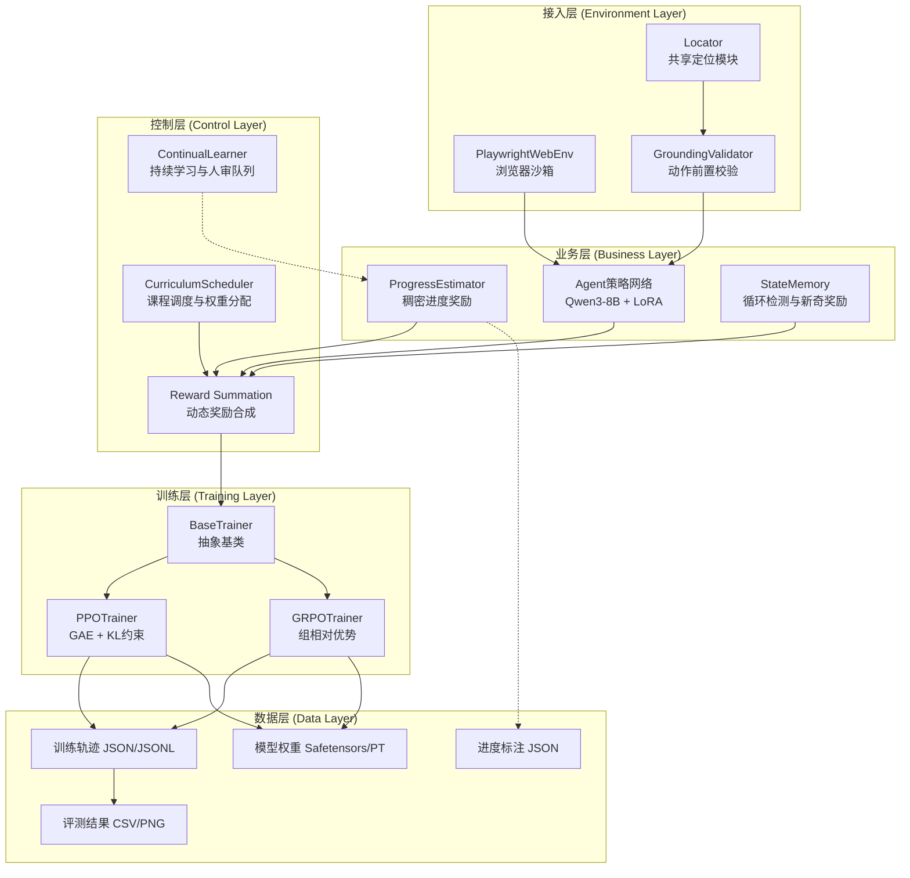
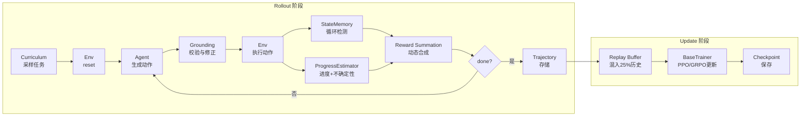
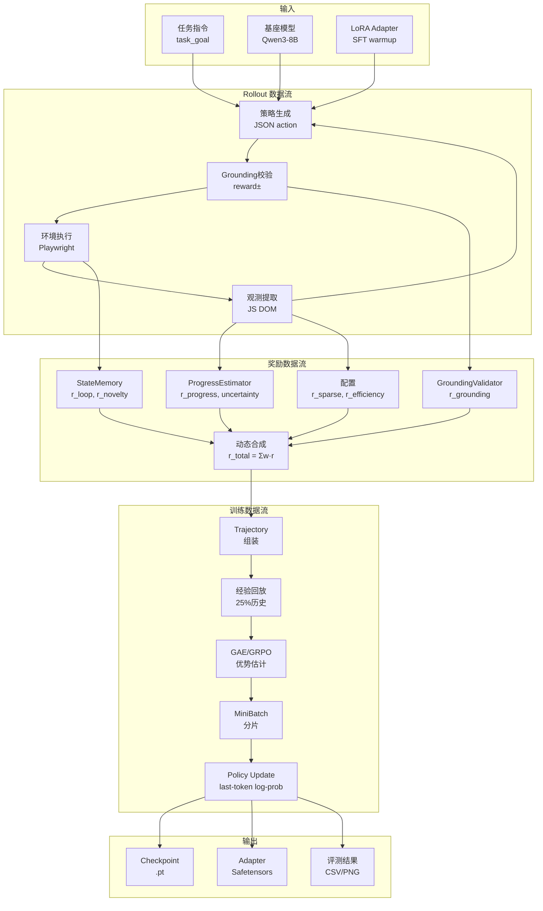

# 3. 整体架构设计

Step-RL v2.0 采用分层解耦的模块化架构，将环境交互、奖励计算、策略优化与训练调度五个维度独立封装，通过 YAML 配置与抽象基类实现插件式扩展。本章从设计原则、分层架构、核心组件协作、技术选型对比、数据流设计与架构演进六个维度，系统阐述系统整体架构设计。

## 3.1 设计原则

### 3.1.1 模块化解耦

系统遵循**单一职责原则（Single Responsibility Principle, SRP）**，将环境（Environment）、奖励（Reward）、策略（Policy）、训练（Training）与评测（Evaluation）五个维度拆分为独立 Python 模块。每个模块暴露标准接口，支持独立单元测试与无依赖替换。例如，`PlaywrightWebEnv` 可通过替换为 `SeleniumWebEnv` 适配其他浏览器自动化方案，而 `ProgressEstimator` 可由基于规则的传统奖励函数替代，无需修改训练器代码。模块间通过数据类（Dataclass）传递结构化数据，消除隐式耦合。

### 3.1.2 可扩展性

系统采用**YAML 配置驱动（YAML Configuration-Driven）** 设计。`config.yaml` 集中定义模型、环境、课程、奖励与训练全部超参数，实现"一份配置、多端复用"。奖励组件采用插件式架构：六维奖励（进度、 grounding、稀疏、效率、新奇、循环）通过 `CurriculumScheduler.get_reward_weights()` 动态获取权重，新增奖励维度仅需实现对应接口并在配置中注册权重系数即可，无需侵入训练主循环。课程级别支持自定义扩展，当前定义四级难度（单页、跨页、复杂表单、多目标），可通过 YAML 追加更高层级任务。

### 3.1.3 安全优先

安全设计贯穿架构每一层。接入层通过 `validate_url()` 实现沙箱域名过滤（Sandbox Domain Filtering），基于 `urlparse` 精确提取 hostname，支持精确匹配与子域名后缀匹配，拦截 `localhost`、`127.0.0.1`、`file://` 等危险地址。选择器输入通过 `escape_css_string()` 与 `escape_xpath_string()` 进行转义（Escaping），处理反斜杠、引号、换行符与空字节，防止 CSS/XPath 注入攻击。容器层 Dockerfile 采用非 root 用户运行（`USER appuser`），阻断容器逃逸风险。模型加载统一使用 `torch.load(..., weights_only=True)`，防御 pickle 反序列化漏洞。

## 3.2 分层架构

系统自底向上划分为接入层、业务层、控制层、训练层与数据层五个层次，每层职责边界清晰、调用关系单向向下。

### 3.2.1 接入层

接入层负责与外部环境（Web 浏览器）交互，包含三个核心模块：`PlaywrightWebEnv` 提供浏览器沙箱生命周期管理（启动、停止、重置、观测提取、动作执行）；`GroundingValidator` 在动作执行前进行前置校验，验证元素存在性与可交互性；`Locator`（`locator.py`）作为共享定位模块，被环境与校验器共同调用，实现多属性级联匹配（Multi-Attribute Cascade Matching），优先级为 `element_id > element_text(+tag) > xpath > css_selector > coordinates`，避免重复代码。

### 3.2.2 业务层

业务层承载智能体核心认知能力。`Agent` 策略网络基于 **Qwen3-8B-Instruct**（大语言模型，LLM）加载 **LoRA（Low-Rank Adaptation，低秩适配）** Adapter，仅微调 0.1% 参数，保持基座通用能力。`ProgressEstimator` 通过冻结的 LLM Encoder 提取语义特征，经 3 层 512 维 MLP 回归头预测任务完成进度 `[0,1]`，并可选通过 **Evidential Learning（证据学习）** 预测 Dirichlet 参数实现不确定性量化。`StateMemory` 采用确定性 **MinHash**（预计算排列加速）与 **LRU（Least Recently Used，最近最少使用）** 淘汰策略，维护最多 500 个已访问状态，检测循环并给予惩罚奖励。

### 3.2.3 控制层

控制层负责训练过程的全局调度与动态协调。`CurriculumScheduler` 实现课程学习（Curriculum Learning），根据当前 epoch 动态调整任务难度采样分布与奖励权重，当某级别成功率 ≥ 90% 时自动晋升。`ContinualLearner` 提供持续学习接口：高置信度轨迹自动标注、低置信度轨迹进入人工审核队列、积累足够样本后触发增量重训练。`Reward Summation` 在 `BaseTrainer._run_episode()` 中执行动态奖励合成，公式为：

```
r_total = α·r_progress·(1-uncertainty) + β·r_grounding + γ·r_sparse + δ·r_efficiency + ε·r_novelty + ζ·r_loop
```

其中权重 `(α,β,γ,δ,ε,ζ)` 随训练阶段动态变化。

### 3.2.4 训练层

训练层提供策略优化抽象。`BaseTrainer` 作为抽象基类（Abstract Base Class, ABC），封装公共逻辑：rollout 收集、经验回放、prompt 构建、奖励计算、检查点管理，消除 PPO 与 GRPO 间 80% 的重复代码。`PPOTrainer` 继承 `BaseTrainer`，实现 **GAE（Generalized Advantage Estimation，广义优势估计）** 与三模型（Policy + Reference + Value）策略更新，支持自适应 KL 约束。`GRPOTrainer` 同样继承 `BaseTrainer`，采用 **Group-Relative Policy Optimization（组相对策略优化）**，以组内回报均值作为基线，消除 Value Model，节省约 30% 显存。两类训练器均使用一致的 **last-token log-prob** 作为动作分布代理，确保 rollout 与 update 阶段概率计算口径一致。

### 3.2.5 数据层

数据层负责全量数据的持久化与生命周期管理。训练轨迹以 JSON/JSONL 格式存储，包含任务目标、难度级别、观测序列、动作序列与奖励序列。进度标注以 JSON 格式存储，字段包括观测文本、目标文本、进度标签、步数与轨迹 ID。模型权重采用 Hugging Face Safetensors 格式与 PyTorch `.pt` 格式双轨保存，LoRA Adapter 单独存储以支持快速切换。评测结果输出为 CSV 表格与 PNG 可视化图表，支持消融实验自动化对比。



## 3.3 核心组件协作

五大核心组件在训练循环中形成紧密协作的闭环。`BaseTrainer.collect_rollouts()` 发起一次 rollout：首先通过 `CurriculumScheduler.sample_task()` 获取当前难度任务，随后 `PlaywrightWebEnv.reset()` 初始化浏览器环境。每一步中，`Agent` 策略网络生成 JSON 格式动作，经 `GroundingValidator.validate_and_correct()` 校验元素存在性与可交互性，若校验失败则尝试基于 Jaccard bigram 相似度的自动修正，仍失败则降级为 `wait` 安全动作。`PlaywrightWebEnv.execute_action()` 执行通过校验的动作，返回新观测。`StateMemory.compute_hash()` 基于确定性 MinHash 计算状态指纹，`update()` 检测循环并计算新奇奖励。`ProgressEstimator` 基于当前观测与目标文本预测进度增量与不确定性，不确定性通过 `(1 - uncertainty)` 衰减进度奖励权重。最终，`Reward Summation` 按课程权重合成总奖励，存储至 `Trajectory` 对象。Rollout 完成后，经验回放区混入 25% 历史轨迹，训练器执行策略更新。



## 3.4 技术选型及对比

### 3.4.1 基座模型与浏览器自动化

**基座模型** 选型聚焦于中文场景与指令遵循能力。Qwen3-8B-Instruct 在中文理解、长文本处理与工具调用（Tool Use）方面表现优异，8B 参数量在 8GB 显存设备上经 4-bit 量化后可流畅运行。同时保留 Qwen2.5-7B/14B 作为降级兼容选项，确保上游模型不可用时系统仍能启动。

**浏览器自动化** 选用 Playwright 而非 Selenium。Playwright 原生支持异步 API（async/await），与 Python 异步训练循环无缝集成；Chromium 无头模式（Headless Mode）稳定性优于 Selenium 的 WebDriver 方案；内置的 `page.evaluate()` 允许直接注入 JavaScript 提取 DOM 属性，比 Selenium 的 accessibility API 更灵活可控。此外，Playwright 的资源拦截（`route.abort()`）机制可阻断图片、CSS、字体等静态资源加载，显著加速页面响应。

| 选型维度 | 候选方案 A | 候选方案 B | 最终选择 | 核心决策依据 |
|---------|-----------|-----------|---------|------------|
| 基座模型 | Qwen3-8B-Instruct | Qwen2.5-7B/14B-Instruct | **Qwen3-8B** | 中文支持优秀、指令遵循能力强、8B 规模适配消费级 GPU |
| 浏览器自动化 | Playwright 1.43+ | Selenium 4.x | **Playwright** | 原生异步支持、Chromium 无头稳定、JS 注入能力、资源拦截 |
| 动作空间 | 结构化 JSON 输出 | 自然语言文本 | **结构化 JSON** | 可解析、可校验、 grounding 友好、支持自动修正 |
| 观测压缩 | JS DOM 提取 | Accessibility Tree | **JS DOM 提取** | 兼容性好、字段可控、Token 可控在 2048 以内 |

### 3.4.2 RL 算法与微调框架

**RL 算法** 提供 PPO 与 GRPO 双轨支持。PPO 采用经典的三模型架构（Policy + Reference + Value），通过 GAE 估计优势，适合显存充裕场景（FP16 约 24GB）。GRPO 是本项目推荐的默认算法，通过组内回报均值替代 Value Model，将模型数量降至两个（Policy + Reference），FP16 显存降至约 16GB，4-bit 量化后仅需 6-7GB，**在 8GB VRAM 设备上可稳定运行**。GRPO 的核心公式为 `A_i = (R_i - mean(R_group)) / (std(R_group) + ε)`，以组为单位的归一化消除了对外部价值估计的依赖。

**微调框架** 采用 PEFT/LoRA（Parameter-Efficient Fine-Tuning，参数高效微调）替代全参数微调。配置 `r=64, lora_alpha=32`，目标模块覆盖 `q_proj/k_proj/v_proj/o_proj/gate_proj/up_proj/down_proj`，仅训练约 0.1% 的参数。对比全参数微调（8B 模型全部 80 亿参数），LoRA 在保持基座通用能力的同时，将训练显存降低约 60%，且 Adapter 文件体积仅数百 MB，支持热插拔切换。

| 选型维度 | 候选方案 A | 候选方案 B | 最终选择 | 核心决策依据 |
|---------|-----------|-----------|---------|------------|
| RL 算法 | PPO (GAE+ValueHead) | GRPO (组相对优势) | **GRPO 默认, PPO 可选** | GRPO 节省 30% VRAM，适合 8GB GPU；PPO 保留用于对比实验 |
| 显存占用(FP16) | PPO ≈ 24GB | GRPO ≈ 16GB | **GRPO 推荐** | 双模型 vs 三模型，消除 Value Model |
| 显存占用(4-bit) | PPO ≈ 10-12GB | GRPO ≈ 6-7GB | **GRPO 推荐** | 消费级 RTX 4060 8GB 可运行 |
| 微调框架 | PEFT/LoRA (r=64) | 全参数微调 | **PEFT/LoRA** | 仅训练 0.1% 参数，显存降低 60%，Adapter 可热插拔 |
| 训练精度 | BF16 | FP16 / FP32 | **BF16** | 训练稳定性与精度平衡，A100/RTX 40 系原生支持 |

**关键结论：GRPO 在显存效率与训练稳定性之间取得最优平衡，是 8GB 级消费 GPU 场景的首选算法；LoRA 则以极低的参数开销实现了基座能力的有效定向迁移。**

## 3.5 数据流设计

系统的数据流贯穿训练全生命周期，可分为 rollout 数据流、奖励数据流、训练数据流与持久化数据流四条主线。

Rollout 数据流：策略网络生成原始文本 → Tokenizer 编码 → 异步环境执行 → 观测文本返回 → 状态哈希计算 → 轨迹对象组装。此流为纯异步，通过 `asyncio` 避免阻塞训练循环。

奖励数据流：观测文本并行输入 `ProgressEstimator`（进度预测）、`GroundingValidator`（校验奖励）、`StateMemory`（循环/新奇奖励）与配置表（稀疏/效率奖励），六路奖励在 `BaseTrainer` 中按动态权重合成，最终写入 `Trajectory.rewards` 列表。

训练数据流：`Trajectory` 经 GAE（PPO）或组归一化（GRPO）计算优势后，与历史回放数据混合，按 `mini_batch_size` 分片，通过 `_get_update_log_probs()` 重新计算 last-token log-prob，执行策略梯度更新。

持久化数据流：每 `save_steps` 个 epoch 触发检查点保存，包含 `policy_state_dict`、`optimizer_state_dict`、`epoch`、`global_step` 与 `kl_coef`。LoRA Adapter 单独保存至 `sft_adapter` 目录。评测结果以 CSV 格式写入 `outputs/benchmark/`。



## 3.6 架构演进（v1.0 → v2.0）

### 3.6.1 v1.0 架构痛点

v1.0 是快速验证原型，架构存在以下结构性问题：奖励权重为硬编码常量，无法适应不同训练阶段的需求；仅支持 PPO 算法，Value Model 在 8GB 显存设备上频繁 OOM（Out of Memory，显存溢出）；缺少循环检测机制，Agent 在复杂页面中容易陷入点击循环；无经验回放（Experience Replay），每轮训练仅使用最新 rollout 数据，样本效率低下；无课程调度，所有任务难度均等采样，导致早期训练信号混乱、收敛缓慢。

### 3.6.2 v2.0 架构重构

v2.0 通过三大重构解决上述痛点。**抽象基类提取**：将 `PPOTrainer` 中与环境交互、奖励计算、检查点管理等公共逻辑提取至 `BaseTrainer`（ABC），PPO 与 GRPO 仅需实现 `update()` 方法，**代码重复率降低约 80%**。**共享定位模块**：提取 `locator.py` 作为独立模块，被 `PlaywrightWebEnv` 与 `GroundingValidator` 共同导入，消除两个模块中各自维护一套级联匹配逻辑的重复问题。**动态能力扩展**：引入 `CurriculumScheduler` 实现三阶段权重调度与自动晋升，`StateMemory` 实现 MinHash 循环检测与 LRU 状态管理，`ContinualLearner` 提供在线数据自举与人工审核闭环。GRPO 算法的加入使系统首次支持 8GB 消费级 GPU 完整训练链路。

**关键结论：v2.0 架构重构不是简单的功能叠加，而是通过抽象基类、共享模块与配置驱动三大机制，将系统从"可运行的原型"升级为"可扩展的生产级训练框架"。**

| 演进维度 | v1.0 状态 | v2.0 改进 | 改进效果 |
|---------|----------|----------|---------|
| 奖励权重 | 硬编码固定值 | 课程三阶段动态调度 | 早期 grounding 主导防幻觉，后期 progress 主导精细化 |
| RL 算法 | 仅 PPO | PPO + GRPO 双轨 | GRPO 节省 30% VRAM，适配 8GB GPU |
| 循环检测 | 无 | MinHash + 滑动窗口 | 循环率从 ~15% 降至 ≤ 6% |
| 经验回放 | 无 | deque(maxlen=10000) + 25% 历史混入 | 样本效率提升，训练稳定性增强 |
| 课程调度 | 无 | 四级难度 + 成功率 90% 自动晋升 | 收敛速度提升，最终成功率 86%~91% |
| 公共逻辑 | PPO 独占 | BaseTrainer 抽象基类 | 代码重复降低 80%，新增算法成本极低 |
| 定位模块 | Env/Validator 各一套 | 共享 locator.py | 消除重复，维护成本减半 |
| 持续学习 | 无 | 高置信自举 + 人审队列 + 增量重训练 | 数据闭环，模型持续进化 |

综上，Step-RL v2.0 的整体架构以分层解耦为骨架、以配置驱动为脉络、以五大核心组件为器官，通过抽象基类与共享模块实现高度复用，通过动态权重与课程调度实现自适应训练，通过安全沙箱与输入转义实现可控运行。该架构在保持研究灵活性的同时，已具备向生产环境迁移的基础条件。
