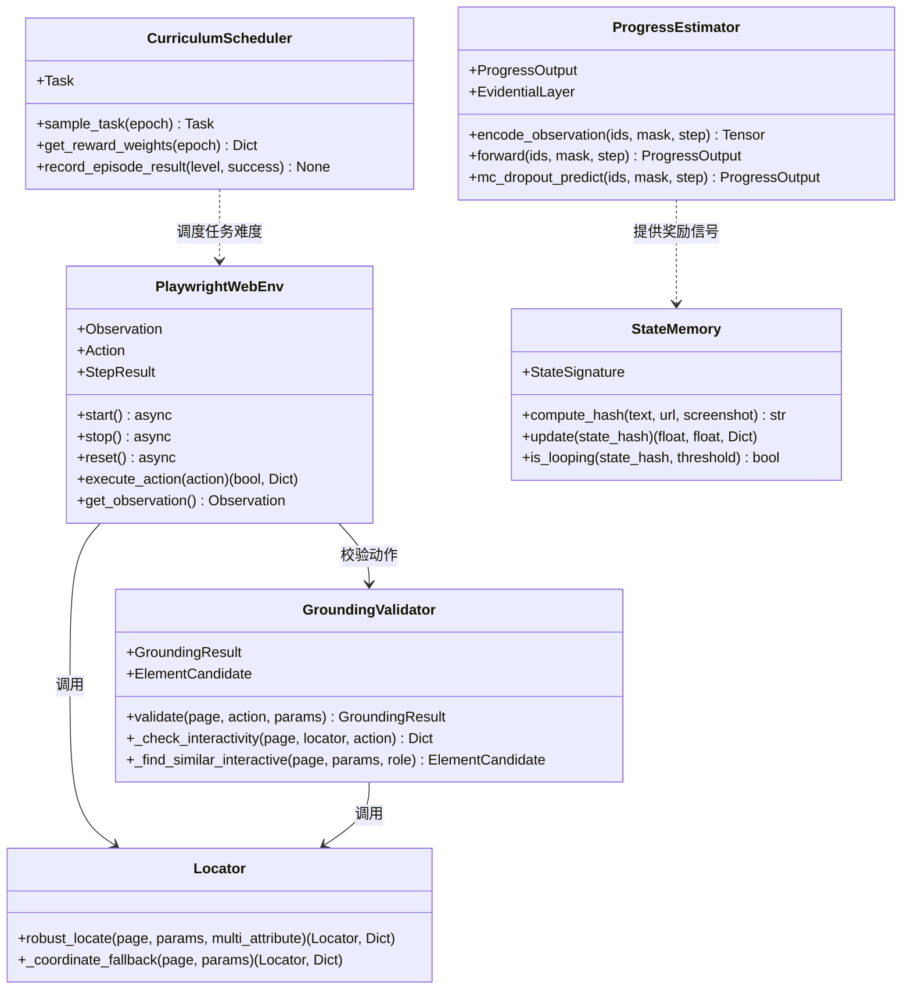
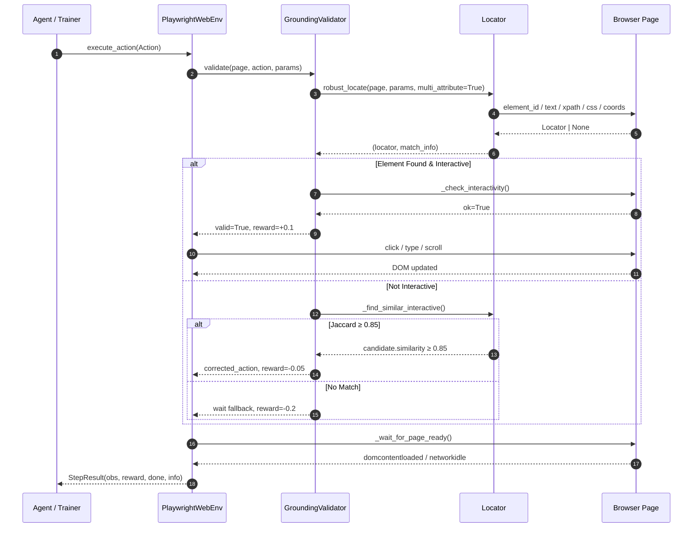
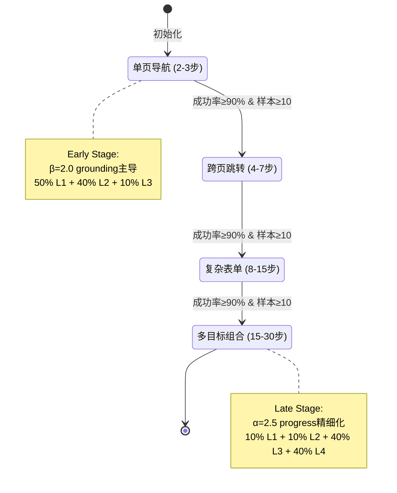

# 第4章 核心模块与接口设计

## 4.1 概述

Step-RL v2.0 的架构采用**分层解耦**（Layered Decoupling）设计哲学，将网页智能体（Web Agent）的训练与推理流程拆分为环境交互层、动作校验层、奖励估计层、状态记忆层和训练调度层。每一层通过显式数据契约（Data Contract）通信，既保证了模块间的独立演化能力，也为后续单元测试和分布式扩展提供了清晰的边界。本章将围绕六大核心模块展开，深入剖析其设计意图、关键实现与接口规范。

## 4.2 环境交互层：PlaywrightWebEnv

### 4.2.1 生命周期与观测压缩

`PlaywrightWebEnv`（基于 [Playwright](https://playwright.dev/) 的异步网页环境）是整个系统的**执行入口**。它封装了浏览器的启动、上下文隔离、页面导航和关闭等全生命周期管理，并通过 `async`/`await` 模式支持高并发任务。观测（Observation）的压缩是环境层的核心挑战：直接传输原始 HTML 会导致上下文窗口爆炸，而纯文本抽取又会丢失交互元素的语义。为此，Step-RL v2.0 采用**双轨提取策略**。

首选方案是 JavaScript DOM 提取器，直接在页面上下文中执行，采集每个交互元素的 `tag`、`role`、`text`、`id` 和屏幕坐标 `coords`。该方案在 Playwright ≥ 1.60 兼容性最佳，因为 `page.accessibility` API 已被移除。当 JS 执行失败时，系统自动降级至 BeautifulSoup 进行纯文本回退。以下代码展示了观测压缩的核心逻辑：

```python
# step_rl/environment/playwright_env.py  lines 234-277
js_code = """
() => {
    const results = [];
    const tags = ['a', 'button', 'input', 'textarea', 'select', 'label',
                  'h1', 'h2', 'h3', 'h4', 'h5', 'h6', 'p', 'span', 'div',
                  'li', 'td', 'th'];
    tags.forEach(tag => {
        document.querySelectorAll(tag).forEach((el, idx) => {
            if (el.offsetParent === null && tag !== 'div') return;
            const rect = el.getBoundingClientRect();
            const text = (el.innerText || el.textContent || el.value || el.placeholder || '').trim();
            const role = el.getAttribute('role') || tag;
            const id = el.id || el.getAttribute('data-testid') || '';
            if (text.length > 0 || id.length > 0 || tag === 'input' || tag === 'button' || tag === 'a') {
                results.push({
                    tag: tag, role: role, text: text.slice(0, 200), id: id,
                    coords: `(${Math.round(rect.x)},${Math.round(rect.y)})`,
                    visible: el.offsetParent !== null
                });
            }
        });
    });
    return results;
}
"""
try:
    elements = await page.evaluate(js_code)
except Exception as e:
    logger.warning(f"JS extraction failed: {e}, falling back to BeautifulSoup")
    html = await page.content()
    from bs4 import BeautifulSoup
    soup = BeautifulSoup(html, "lxml")
    text = soup.get_text(separator="\n", strip=True)
```

**安全沙箱**（Security Sandbox）是环境层的另一重要设计。通过 `validate_url` 实现精确域名匹配，并利用 `blocked_domains` 拦截对 `localhost`、`127.0.0.1` 等私有地址的访问，确保训练过程不会触及内网服务。动作空间（Action Space）采用受限设计，仅开放 `click`、`type`、`scroll`、`goto`、`wait`、`finish` 六种原子操作，降低策略输出的组合爆炸风险。

### 4.2.2 动作执行与后置稳定性等待

`execute_action` 方法负责将策略输出的 `Action` 对象转换为浏览器操作。对于 `click` 和 `type` 类动作，环境层委托 `robust_locate` 解析元素定位参数；对于页面跳转类动作，则在执行后触发**后置稳定性等待**（Post-Action SPA Wait），通过 `wait_for_load_state` 监听 `domcontentloaded` 和 `networkidle` 事件，以适配单页应用（SPA）的异步渲染特性。

## 4.3 动作校验层：GroundingValidator

### 4.3.1 校验流程与级联匹配

`GroundingValidator` 是连接策略输出与真实 DOM 的**鲁棒性阀门**。它通过四级校验流水线确保动作的可执行性：元素存在性 → 可交互性（visible + enabled + bounding_box）→ 角色合法性 → 自动修正。对于 `click` 和 `type` 动作，若目标元素未通过校验，系统不会直接失败，而是触发**多属性级联匹配**（Multi-Attribute Cascade Matching）。

级联优先级严格遵循 `element_id > element_text + tag > xpath > css_selector > coordinate_fallback`。这一定序基于信噪比假设：带有稳定 ID 的元素通常最可靠，而纯坐标（coordinates）因分辨率差异和动态布局风险最高，仅作为最后手段。级联逻辑被提取到独立的 `locator.py` 模块中，供 `PlaywrightWebEnv` 和 `GroundingValidator` 复用，避免了代码冗余。

```python
# step_rl/environment/grounding_validator.py  lines 70-125
async def validate(self, page, action, params):
    if action in ("wait", "finish"):
        return GroundingResult(valid=True, reward=0.0)
    if action == "goto":
        url = params.get("url", "")
        if not url.startswith(("http://", "https://", "about:")):
            return GroundingResult(valid=False, reward=self.reward_failed, corrected_action=self._wait_action())
        return GroundingResult(valid=True, reward=self.reward_valid)
    if action == "scroll":
        return GroundingResult(valid=True, reward=self.reward_valid)
    # For click / type: need element
    locator, match_info = await robust_locate(page, params, multi_attribute_match=self.multi_attribute_match)
    if locator is not None:
        interactivity = await self._check_interactivity(page, locator, action)
        if interactivity["ok"]:
            return GroundingResult(valid=True, reward=self.reward_valid, locator=locator, match_info=match_info)
        else:
            candidate = await self._find_similar_interactive(page, params, expected_role=interactivity.get("expected_role", ""))
            if candidate and candidate.similarity >= self.similarity_threshold:
                corrected = {"action": action, "params": {**params, **candidate.to_action()}}
                return GroundingResult(valid=False, reward=self.reward_corrected, corrected_action=corrected)
```

### 4.3.2 智能修正与误差量化

当元素存在但不可交互（例如被遮罩或处于禁用状态），或者元素完全未找到时，`GroundingValidator` 启动**智能修正**（Smart Auto-Correction）。该机制基于 Jaccard 字符二元组（character bigram）相似度，在页面所有可交互元素中检索最相似的候选。若相似度达到阈值 `≥ 0.85`，则自动替换目标参数并返回降级动作；否则将动作降级为安全的 `wait`。

为了量化校验质量对策略学习的反馈，系统引入三级奖励信号：`valid`（+0.1）表示完全通过；`corrected`（-0.05）表示通过修正后勉强执行；`failed`（-0.2）表示彻底失败。这一梯度设计使得策略网络能够区分"精确命中"与"勉强可用"之间的微妙差异，从而逐步学习更稳健的网页定位策略。

## 4.4 奖励估计层：ProgressEstimator

### 4.4.1 模型架构与不确定性估计

`ProgressEstimator` 是 Step-RL v2.0 的**稠密奖励引擎**。它采用**冻结编码器**（Frozen Encoder）范式：以 `Qwen3-8B` 的预训练模型作为语义提取 backbone，其参数全部冻结，仅通过适配器头（Adapter Heads）进行微调。这种设计在保持大语言模型语义理解能力的同时，显著降低了训练显存和计算开销。

在编码器之上，系统并行部署两个功能头：一个是 3 层 MLP 回归头（`progress_head`，隐藏层维度 512），负责预测任务完成进度 `progress ∈ [0,1]`；另一个是 **证据学习头**（Evidential Head，基于 Evidential Learning），通过预测 Dirichlet 分布的四个参数（`gamma`、`nu`、`alpha`、`beta`）来估计认知不确定性（Epistemic Uncertainty），其中不确定性定义为 `uncertainty = 1 / (nu + ε)`。对于不支持显式证据学习的环境，系统还提供了 MC Dropout 回退方案。

```python
# step_rl/reward/progress_estimator.py  lines 157-178
def _sync_device(self):
    """Detect the encoder's actual device and move custom heads there."""
    try:
        encoder_device = next(self.encoder.parameters()).device
    except StopIteration:
        return
    if encoder_device.type != "cpu":
        self.progress_head = self.progress_head.to(encoder_device)
        self._step_count_embedding = self._step_count_embedding.to(encoder_device)
        self._projector = self._projector.to(encoder_device)
        if self.use_uncertainty:
            if self.uncertainty_method == "evidential":
                self.uncertainty_head = self.uncertainty_head.to(encoder_device)
            elif self.uncertainty_method == "mc_dropout":
                self.mc_head = self.mc_head.to(encoder_device)
            else:
                self.uncertainty_head = self.uncertainty_head.to(encoder_device)
```

`_sync_device` 方法解决了多设备部署时的常见陷阱：当 `device_map="auto"` 将编码器分配到 GPU 时，PyTorch 默认会将自定义的 `nn.Module` 子层保留在 CPU 上。该方法通过检测编码器实际所在的设备，显式迁移所有自定义头，从而避免了跨设备张量拷贝导致的性能损耗和运行时错误。

### 4.4.2 多目标损失与单调性约束

为了将大语言模型的语义表示转化为可微的进度信号，`ProgressEstimator` 采用**四目标复合损失**（Multi-Objective Loss）：`MSE` 提供监督信号；`Margin Ranking Loss` 在对比样本对上施加相对序约束；`Monotonicity Hinge Loss` 通过 `ReLU(-diff)` 强制同一轨迹内进度随时间单调不减；`Evidential NLL` 则校准不确定性估计的统计一致性。这种组合使得模型不仅关注绝对精度，还关注时间一致性和比较关系，显著提升了长程网页任务中的奖励稳定性。

## 4.5 状态记忆层：StateMemory

### 4.5.1 确定性哈希与 MinHash 指纹

`StateMemory` 负责解决网页环境中的**状态混淆**（State Aliasing）问题。由于网页 URL 相同而 DOM 结构不同的情况极为常见，系统采用 `StateSignature` 对 URL、DOM 文本和视觉特征进行联合哈希。核心哈希算法使用**确定性 MinHash**（Deterministic MinHash）：通过预计算排列（precomputed permutations）对文本的二元词组（word shingles）建立局部敏感哈希指纹，替代了传统方案中随机种子的不确定性，保证了跨进程、跨运行的一致性。

```python
# step_rl/memory/state_memory.py  lines 81-123
def _minhash(self, text, url, num_perm=64):
    words = text.lower().split()
    if len(words) < 2:
        return self._simple_hash(text, url)
    shingles = set()
    for i in range(len(words) - 1):
        shingles.add(f"{words[i]} {words[i+1]}")
    p = (1 << 61) - 1
    hashes = []
    for seed in range(num_perm):
        a = (seed * 1234567891 + 1) & 0xFFFFFFFFFFFFFFFF
        b = (seed * 9876543211 + 1) & 0xFFFFFFFFFFFFFFFF
        min_val = p
        for s in shingles:
            h = int(hashlib.md5(s.encode()).hexdigest(), 16)
            perm = ((h * a + b) & 0xFFFFFFFFFFFFFFFF) % p
            if perm < min_val:
                min_val = perm
        hashes.append(min_val)
    band_size = 4
    bands = []
    for i in range(0, num_perm, band_size):
        band = tuple(hashes[i : i + band_size])
        band_hash = hashlib.md5(str(band).encode()).hexdigest()[:4]
        bands.append(band_hash)
    url_h = hashlib.md5(url.encode()).hexdigest()[:8]
    return f"mh-{url_h}-{'-'.join(bands)}"
```

对于短文本场景，系统会自动降级为 `hashlib.md5` 直接哈希，避免无意义的 shingle 分裂。这种**分层哈希策略**（Hierarchical Hashing）在精确度与计算效率之间取得了平衡。

### 4.5.2 循环检测与新奇性奖励

`StateMemory` 通过滑动窗口（`loop_window = 3`）检测局部循环：当同一状态在最近 3 步内重复出现时，触发 `loop_penalty_base = -0.1` 的惩罚，且惩罚随循环次数累加。与此同时，首次访问的状态会获得**新奇性奖励**（Novelty Bonus），其数值随已访问状态集合的填充率衰减，从而鼓励智能体在训练初期探索更广阔的网页空间。

内存管理采用 **LRU（Least Recently Used）** 策略，通过 `OrderedDict` 配合 `popitem(last=False)` 实现真正的最近最少使用淘汰。当已访问状态数超过 `max_states = 500` 时，最旧的状态被移除，确保内存占用始终可控。

## 4.6 训练调度层：CurriculumScheduler

### 4.6.1 四级课程与动态采样

`CurriculumScheduler` 实现了**课程学习**（Curriculum Learning）的自动化编排。它将任务划分为四个难度等级：L1 单页导航（2-3 步）、L2 跨页跳转（4-7 步）、L3 复杂表单（8-15 步）、L4 多目标组合（15-30 步）。采样分布随训练进度动态迁移：早期 50% L1 + 40% L2 + 10% L3，让智能体先掌握基础动作；晚期则调整为 10% L1 + 10% L2 + 40% L3 + 40% L4，重点攻坚复杂任务。

```python
# step_rl/training/curriculum_scheduler.py  lines 167-183
def record_episode_result(self, level, success):
    self._level_success_rates[level].append(1.0 if success else 0.0)
    self._level_success_rates[level] = self._level_success_rates[level][-20:]
    self._check_promotion()

def _check_promotion(self):
    current = self._current_level
    rates = self._level_success_rates.get(current, [])
    if len(rates) >= 10:
        avg = sum(rates) / len(rates)
        if avg >= self.promotion_threshold and current < max(self.levels.keys()):
            self._current_level += 1
            print(f"[Curriculum] Promoted to Level {self._current_level} (avg success={avg:.2%})")
```

晋升机制（Promotion Logic）是课程学习的核心闭环：当当前等级的最近 20 条样本成功率达到 `≥ 90%` 且样本量不少于 10 条时，自动解锁下一等级。这种**数据驱动的晋升**避免了人工预设 epoch 的僵化，使课程进度与智能体实际能力匹配。

### 4.6.2 权重调度与奖励塑形

除了任务采样，`CurriculumScheduler` 还动态调节各奖励分量的权重。早期 `β = 2.0` 使**动作接地奖励**（Grounding Reward）主导，强迫智能体先学会正确点击和输入；中期 `α = 2.0` 切换为**进度奖励**（Progress Reward）主导，推动任务完成；晚期 `α = 2.5` 进一步精细化进度估计，同时降低新奇性奖励 `ε = 0.2` 以防止过度探索干扰收敛。这种**阶段性奖励塑形**（Phased Reward Shaping）是长程网页任务稳定训练的关键。

## 4.7 接口契约规范

下表汇总了六大核心模块之间的关键接口契约，明确了输入、输出和不变式：

| 接口 | 调用方 | 被调用方 | 输入契约 | 输出契约 | 关键不变式 |
|:---|:---|:---|:---|:---|:---|
| `execute_action(action)` | Agent / Trainer | `PlaywrightWebEnv` | `Action` 对象，action ∈ {click, type, scroll, goto, wait, finish} | `(bool, Dict)` | 页面处于 ready 状态后返回 |
| `validate(page, action, params)` | `PlaywrightWebEnv` | `GroundingValidator` | `Page` 实例 + 原始动作参数 | `GroundingResult` | reward ∈ {+0.1, -0.05, -0.2} |
| `robust_locate(page, params)` | `GroundingValidator` / `PlaywrightWebEnv` | `Locator` | `params` 含 element_id/text/xpath/css/coords 至少一项 | `(Locator, match_info)` | 按优先级返回首个命中 |
| `forward(ids, mask, step)` | Trainer | `ProgressEstimator` | `input_ids`, `attention_mask`, `step_count` | `ProgressOutput` | progress ∈ [0,1], uncertainty ∈ [0,1] |
| `update(state_hash)` | `PlaywrightWebEnv` | `StateMemory` | 确定性哈希字符串 | `(r_loop, r_novelty, info)` | `r_loop ≤ 0`, `r_novelty ≥ 0` |
| `sample_task(epoch)` | Trainer | `CurriculumScheduler` | 可选 epoch 索引 | `Task` 或 `None` | 仅采样已解锁等级 |
| `get_reward_weights(epoch)` | Trainer | `CurriculumScheduler` | 可选 epoch 索引 | `Dict[str, float]` | 权重总和为固定常数 |

## 4.8 总结

Step-RL v2.0 的六大核心模块通过**严格的分层职责划分**和**显式接口契约**，构建了一个可扩展、可测试、可调试的网页智能体训练框架。**`PlaywrightWebEnv` 的异步双轨观测压缩与沙箱安全**保证了环境交互的鲁棒性；**`GroundingValidator` 的多属性级联匹配与智能修正**将动作失败率从二元崩溃转化为梯度学习信号；**`ProgressEstimator` 的冻结编码器与四目标复合损失**提供了语义一致且时间单调的稠密奖励；**`StateMemory` 的确定性 MinHash 与 LRU 管理**消除了状态混淆和循环震荡；**`CurriculumScheduler` 的数据驱动晋升与动态权重调度**则实现了训练难度的自动适配。这些设计的协同作用，使得 Step-RL v2.0 在长程、复杂、动态的网页任务中具备工业级部署能力。

---






