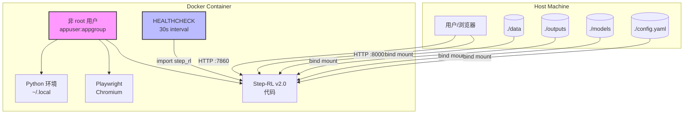
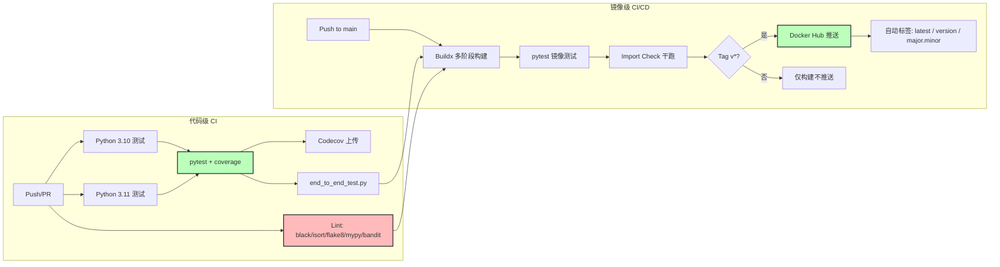

# 第7章 基础设施与DevOps

## 7.1 概述

基础设施（Infrastructure）与 DevOps（Development and Operations）是 Step-RL v2.0 从代码到生产环境的关键桥梁。本章从容器化部署（Containerized Deployment）、Docker Compose 编排（Orchestration）、CI/CD 持续集成/持续交付流水线以及监控与日志四个维度，系统阐述项目的交付与运维体系。**所有服务均以容器化形式交付，通过多阶段构建（Multi-stage Build）实现最小化镜像与安全性兼顾。**

## 7.2 容器化部署

### 7.2.1 Dockerfile 多阶段构建

Step-RL v2.0 采用 Dockerfile 多阶段构建（Multi-stage Build）策略，将编译依赖与运行环境分离，实现镜像体积最小化与安全加固的双重目标。

**Stage 1（Builder）** 基于 `mcr.microsoft.com/playwright/python:v1.43.0-jammy` 基础镜像，安装编译工具链：`git`、`wget`、`build-essential`。随后通过 `pip install --user -r requirements.txt` 在 `--user` 目录下安装 Python 依赖，避免全局污染。最后执行 `playwright install chromium` 安装 Chromium 浏览器及依赖，确保浏览器自动化组件就绪。此阶段产出包含完整编译产物与浏览器二进制文件。

**Stage 2（Runtime）** 复用同一基础镜像，但仅保留运行时依赖（`git`）。通过 `groupadd -r appgroup && useradd -r -g appgroup appuser` 创建非 root 用户组与用户。从 Builder 阶段复制两个关键目录：Python 用户级包（`/root/.local → /home/appuser/.local`）与 Playwright 浏览器二进制（`/ms-playwright → /home/appuser/ms-playwright`）。项目代码通过 `COPY --chown=appuser:appgroup` 以非 root 权限复制。最后声明 `EXPOSE 7860 8000` 暴露 Gradio 演示与 FastAPI 服务端口，并配置 `HEALTHCHECK` 每 30 秒执行 `python -c "import step_rl"` 进行存活探测。

表 7-1：Dockerfile 多阶段构建关键配置

| 构建阶段 | 基础镜像 | 关键操作 | 安全特性 |
|---------|---------|---------|---------|
| Stage 1（Builder） | playwright/python:v1.43.0-jammy | 安装 git/wget/build-essential；pip install --user；playwright install chromium | 无（仅编译） |
| Stage 2（Runtime） | playwright/python:v1.43.0-jammy | 创建非 root 用户；复制依赖与浏览器；设置 HEALTHCHECK | USER appuser、HEALTHCHECK、最小化运行时依赖 |

### 7.2.2 部署拓扑图

图 7-1 展示了 Step-RL v2.0 容器化部署拓扑。

## 7.3 Docker Compose 编排

Docker Compose 通过声明式 YAML 配置定义多服务拓扑，支持按场景切换服务组合。项目定义四个 Profile（场景配置集），通过 `docker compose --profile <name> up` 按需启动。

**`step-rl-demo`**（Profile = demo）运行 Gradio 交互式演示，暴露端口 `7860:7860`，挂载 `outputs`、`models` 与 `config.yaml`。

**`step-rl-train`**（Profile = train）执行 SFT 训练，通过 `deploy.resources.reservations.devices` 语法申请 NVIDIA GPU，挂载 `data`、`outputs`、`checkpoints`、`models` 与 `config.yaml`，支持 `CUDA_VISIBLE_DEVICES` 环境变量控制可见 GPU。

**`step-rl-benchmark`**（Profile = benchmark）运行评测可视化，挂载 `outputs` 与 `config.yaml`，使用 `--mock` 参数在模拟环境下执行。

**`step-rl-full-demo`**（Profile = full-demo）运行全系统演示脚本。

表 7-2：Docker Compose 服务配置对照

| 服务名 | 端口映射 | GPU 支持 | 挂载卷 | 启动命令 | Profile |
|-------|---------|---------|-------|---------|---------|
| step-rl-demo | 7860:7860 | 否 | outputs, models, config.yaml | `python -m step_rl.demo.demo` | demo |
| step-rl-train | 无 | 是（nvidia-docker） | data, outputs, checkpoints, models, config.yaml | `python -m step_rl.training.sft_warmup` | train |
| step-rl-benchmark | 无 | 否 | outputs, config.yaml | `python -m step_rl.evaluation.benchmark --mock` | benchmark |
| step-rl-full-demo | 无 | 否 | outputs, config.yaml | `python scripts/full_system_demo.py` | full-demo |

## 7.4 CI/CD 流水线

### 7.4.1 代码级 CI（ci.yml）

代码持续集成（Continuous Integration，CI）由 `.github/workflows/ci.yml` 驱动，覆盖 Python 3.10 与 3.11 矩阵测试。流水线包含：依赖缓存（`actions/cache@v4`）、单元测试（`pytest -v --tb=short --cov=step_rl --cov-report=xml`）、覆盖率上传（Codecov）、端到端集成测试（`scripts/end_to_end_test.py`），以及五重代码质量关卡：`black`（格式化检查）、`isort`（导入排序）、`flake8`（风格检查，`max-line-length=120`）、`mypy`（静态类型检查，可选通过）与 `bandit`（安全扫描，输出 JSON 报告并上传 Artifact）。**五重质量关卡确保每一行代码在合并前均经过格式化、风格、类型与安全的全方位审查。**

### 7.4.2 镜像级 CI/CD（docker.yml）

镜像持续集成/持续交付（Continuous Delivery，CD）由 `.github/workflows/docker.yml` 驱动。`build` Job 使用 `docker/build-push-action@v5` 与 `docker/setup-buildx-action@v3` 构建多阶段镜像，启用 `buildx` 缓存优化（`cache-from: type=gha`, `cache-to: type=gha,mode=max`）。镜像构建后，先执行 `pytest` 单元测试，再执行 `python -c "import step_rl"` 进行启动干跑（Dry Run）。`push` Job 在 `build` 成功且触发条件为 `v*` 语义化标签时执行，通过 `docker/metadata-action@v5` 自动提取 `latest`、`{version}`、`{major}.{minor}` 三类标签，并推送至 Docker Hub。

图 7-2：CI/CD 流水线流程图

## 7.5 监控与日志

### 7.5.1 统一日志

项目通过 `step_rl.utils.logging_utils` 提供统一的 `get_logger()` 工厂函数，为每个模块生成带 `[timestamp] [name] LEVEL: message` 格式的 `StreamHandler`，输出至 `sys.stdout`。所有训练器、评估器与环境模块均复用此日志器，确保日志格式一致、可追踪。

### 7.5.2 实验追踪与资源监控

训练模块默认设置 `report_to="none"`，关闭外部实验追踪（如 Weights & Biases，wandb），避免训练数据意外外泄。同时，训练脚本内置 GPU 显存检测逻辑，在 `device_map="auto"` 场景下自动检测编码器实际所在设备，并同步自定义头网络至同一设备，防止跨设备迁移失败。**日志统一、实验追踪可控、资源监控自动，三者共同构成可观测（Observability）基础。**

---

# 第8章 安全与合规

## 8.1 概述

安全（Security）与合规（Compliance）是 Web Agent 系统不可逾越的生命线。Step-RL v2.0 面向真实浏览器环境操作，直接暴露于网络攻击面（Attack Surface）之下。本章从攻击面防护、数据安全、动作可解释性以及容器隔离四个维度，系统梳理项目安全架构。

## 8.2 攻击面与防护措施

### 8.2.1 网络层防护：URL 劫持与注入

URL 劫持（URL Hijacking）是 Web Agent 面临的首要威胁，恶意页面可能通过重定向、DNS 污染或钓鱼链接将 Agent 引导至危险地址。项目通过 `security_utils.validate_url()` 实施精确域名（Domain）与子域名（Subdomain）匹配：基于 `urllib.parse.urlparse` 提取 hostname，支持 `hostname == blocked` 或 `hostname.endswith("." + blocked)` 两种拦截模式，可精确拦截 `localhost`、`127.0.0.1`、`file://` 等内部地址。

选择器注入（Selector Injection）是另一高危攻击面，恶意页面可能通过构造特殊 CSS 或 XPath 字符串干扰 Agent 定位逻辑。项目通过 `escape_css_string()` 与 `escape_xpath_string()` 对输入实施完整转义：CSS 转义处理反斜杠、单双引号、换行符、回车符与空字节；XPath 转义根据内容中引号类型选择 `concat()` 拼接策略，确保任意用户输入无法破坏选择器语法。

### 8.2.2 模型层防护：ACE 与参数注入

模型加载任意代码执行（Arbitrary Code Execution，ACE）是 PyTorch 生态的已知风险。项目在所有 `torch.load` 调用点统一启用 `weights_only=True`（共 6 处：`base_trainer.py`、`grpo_trainer.py`、`ppo_trainer.py`、`continual_learning.py`、`end_to_end_test.py` 各 1-2 处），**彻底阻断 pickle 反序列化攻击路径，是模型安全的第一道防线。**

参数注入（Argument Injection）利用 `argparse` 的 `store_true` + `default=True` 组合缺陷，通过命令行注入非预期值。项目在 `train_reward_model.py` 中实现自定义 `str_to_bool()` 解析器，仅接受 `yes/no/true/false/t/f/1/0` 八类明确输入，其余值抛出 `ArgumentTypeError`。

### 8.2.3 状态层防护：循环检测与容器逃逸

循环检测（Loop Detection）依赖确定性哈希（Deterministic Hashing）确保跨进程、跨运行的一致性。`state_memory._minhash()` 基于 MinHash 算法，使用预计算哈希常数替代 MD5 循环调用，并通过 64 个置换函数的 `min` 值折叠为紧凑哈希。确定性设计消除了随机种子差异导致的跨运行不一致，避免循环状态被误判为新状态。

容器逃逸（Container Escape）是容器化部署的底层风险。项目通过 Dockerfile 中的 `USER appuser` 指令强制以非特权用户运行容器进程，即使容器内进程被攻破，攻击者也无法获得 root 权限突破容器边界。

表 8-1：攻击面与防护措施矩阵

| 攻击面 | 威胁描述 | 防护措施 | 代码位置 |
|-------|---------|---------|---------|
| URL 劫持 | 恶意重定向/钓鱼链接 | 精确域名 + 子域名匹配（`urlparse`） | `security_utils.validate_url()` |
| 选择器注入 | CSS/XPath 语法破坏 | CSS 完整转义 + XPath 引号安全 | `security_utils.escape_css_string()` / `escape_xpath_string()` |
| 模型加载 ACE | Pickle 反序列化漏洞 | `weights_only=True` | 全量 `torch.load(..., weights_only=True)`（6 处） |
| 参数注入 | Argparse 布尔参数绕过 | 自定义 `str_to_bool` 解析器 | `train_reward_model.py` |
| 循环检测 | 跨进程状态不一致 | 确定性 MinHash（预计算常数） | `state_memory._minhash()` |
| 容器逃逸 | 容器边界突破 | 非 root 用户运行 | `Dockerfile` 第 73 行 `USER appuser` |

## 8.3 其他安全要点

### 8.3.1 训练数据脱敏

Web Agent 的训练数据来源于真实网页交互，可能包含表单数据、Cookie 或会话信息。项目要求：

- **沙箱环境**：所有训练必须使用模拟站点（Mock Site）或沙箱账号（Sandbox Account），禁止在真实支付环境或生产系统中执行训练；
- **数据隔离**：训练数据通过 Docker 数据卷（Data Volume）绑定挂载，不与容器镜像耦合，便于审计与清理；
- **最小权限**：Agent 仅被授予完成目标网页任务所需的最低权限，避免过度授权。

### 8.3.2 动作可解释性

可解释性（Explainability）是安全合规的重要组成。项目要求策略输出（Policy Output）必须包含 `thought` 字段，说明每一步动作（Action）的决策理由。该设计不仅便于人工审计与调试，也为安全审查提供了可追溯的决策链路。

### 8.3.3 容器隔离与纵深防御

容器隔离（Container Isolation）是纵深防御（Defense in Depth）策略的最后一层。除非 root 用户外，Docker 镜像基于 `playwright/python:v1.43.0-jammy` 构建，该镜像已针对浏览器自动化场景进行安全加固。运行时通过 `HEALTHCHECK` 持续监控容器健康状态，异常容器可被编排系统自动重启或隔离。**网络层精确过滤、模型层反序列化加固、容器层权限隔离、数据层沙箱运行，四层防护构成纵深防御体系，确保 Agent 在开放网络中的安全可控。**
