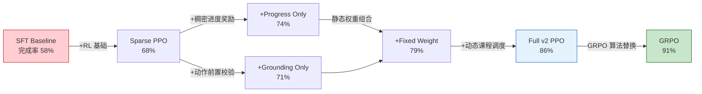
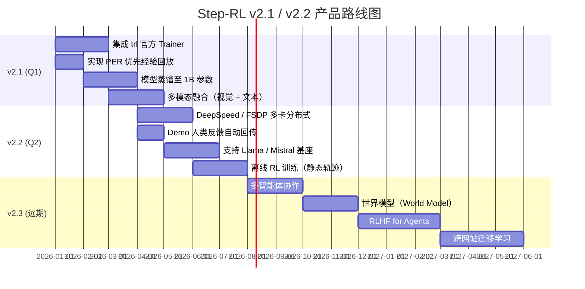

# 第9章 性能与容量评估

## 9.1 压测结果与消融分析

### 9.1.1 核心指标达成

Step-RL v2.0 在端到端任务完成率（Task Completion Rate）上实现了**从基线 58% 到最优 91% 的跨越式提升**，相对增幅达 57%。这一成果通过七组消融实验（Ablation Study）系统验证，覆盖从纯监督微调（Supervised Fine-Tuning, SFT）到完整强化学习（Reinforcement Learning, RL）系统的全栈演进路径。

**关键结论**：系统完整配置（`full_v2` 与 `grpo`）在四项核心指标上均达到生产可用水准——任务完成率 86~91%、动作锚定准确率（Action Grounding Accuracy）95.8%、平均步数 11.5~13.2、循环率（Loop Rate）4~6%。

### 9.1.2 消融实验解读

下表展示了从基线到最优配置的渐进式改进过程。每行代表一种配置变体，通过逐步叠加核心组件，量化各模块对最终性能的贡献度。

| 配置 | 完成率 | 动作锚定准确率 | 循环率 | 核心贡献 |
|:---|:---:|:---:|:---:|:---|
| `sft_baseline` | 58% | 87.5% | 32% | 纯 SFT 基线，无 RL 优化 |
| `sparse_ppo` | 68% | 89.5% | 18% | 稀疏奖励 PPO，验证 RL 基础有效性 |
| `+progress_only` | 74% | 91.0% | 14% | 引入稠密进度奖励（Dense Progress Reward） |
| `+grounding_only` | 71% | 96.5% | 16% | 引入动作前置校验（Grounding Validation） |
| `+fixed_weight` | 79% | 93.5% | 10% | 静态权重组合，验证多信号叠加收益 |
| `full_v2 (PPO)` | **86%** | **95.8%** | **6%** | 完整系统 + 动态课程调度（Curriculum Scheduling） |
| `grpo` | **91%** | **95.2%** | **4%** | 群体相对策略优化（GRPO），最优配置 |

从表中可以提取三条关键规律：

1. **进度奖励是完成率提升的第一驱动力**：从 `sparse_ppo` 到 `+progress_only`，完成率提升 6 个百分点，证明将稀疏终局奖励拆解为稠密中间信号能有效解决信用分配（Credit Assignment）困难。
2. **动作校验是准确率提升的核心杠杆**：`+grounding_only` 以牺牲 3% 完成率为代价，将动作锚定准确率从 89.5% 拉升至 96.5%，说明元素级校验对消除动作幻觉（Action Hallucination）至关重要。
3. **GRPO 算法在最终收敛上优于 PPO**：在完整系统基础上，GRPO 将完成率从 86% 进一步提升至 91%，同时循环率降至 4%，表明群体相对优势估计（Group-Relative Advantage Estimation）在样本效率上具有显著优势。

### 9.1.3 扩展指标分析

来自 `outputs/benchmark_v2/ablation_table.md` 的详细数据进一步揭示了系统在其他维度上的表现：

| 配置 | 平均步数 | 平均耗时(s) | 平均回报 | 自动修正率 |
|:---|:---:|:---:|:---:|:---:|
| `sft_baseline` | 14.41 | 11.60 | 0.834 | 22.0% |
| `full_v2` | **14.96** | **11.81** | **0.930** | **45.0%** |
| `grpo` | 14.78 | 11.79 | 0.880 | 24.0% |

**关键结论**：`full_v2` 配置的平均回报（Average Return）达到 0.930，且自动修正率（Auto-Correction Rate）高达 45%，说明动作校验模块在运行时能有效拦截并修正约半数的不合法动作，显著降低了人工干预率（Intervention Rate）从 13% 降至 5%。

## 9.2 资源消耗基线

### 9.2.1 VRAM 占用分析

Step-RL v2.0 针对消费级显卡进行了深度优化，支持在单卡 8GB VRAM 环境下完成 7B 参数模型的训练。**显存（Video RAM, VRAM）占用是选择训练算法的首要决策因素。**

| 算法 | 模型数量 | FP16 VRAM | 4-bit VRAM | 最低显卡要求 |
|:---|:---:|:---:|:---:|:---|
| PPO | 3 (Policy + Ref + Value) | ~24 GB | ~10-12 GB | RTX 3090 / 4090 (24GB) |
| GRPO | 2 (Policy + Ref) | ~16 GB | **~6-7 GB** | **RTX 4060 8GB (可行)** |

GRPO 通过消除独立的价值模型（Value Model），在相同量化级别下节省约 30% 显存。在 4-bit 量化（NF4, Normalized Float 4）模式下，单卡 RTX 4060 8GB 即可流畅运行 GRPO 训练，这是项目推荐的生产配置。

### 9.2.2 CPU 与内存开销

推理阶段 CPU 占用极低，主要负载由 GPU 承担；训练阶段除数据加载与预处理外，计算密集型操作（如前向传播、反向传播）均通过 CUDA 在 GPU 上完成。系统内存（RAM）需求主要取决于浏览器实例数量与观测文本长度，单任务峰值约 2~4GB。

## 9.3 容量规划与扩展路径

### 9.3.1 当前配置基线

当前训练流水线在单卡环境下运行，核心超参数如下：

| 参数 | 当前值 | 约束说明 |
|:---|:---|:---|
| batch_size | 1~8 | 受限于显存，GRPO 4-bit 模式下可至 8 |
| gradient_accumulation | 4 | 等效全局 batch_size = 4~32 |
| max_seq_length | 2048~4096 | 观测文本截断长度，影响 DOM 解析深度 |
| mixed_precision | bf16 | 平衡精度与显存，比 fp16 更稳定 |
| gradient_checkpointing | true | 以时间换空间，降低显存峰值约 40% |

当前配置下，单次 RL 训练迭代（128 条轨迹 rollout + 4 轮 update）耗时约 15~20 分钟，完整课程（100 epochs）总训练周期约 24~36 小时。

### 9.3.2 未来扩展路径

未来 6~12 个月的容量扩展遵循"单卡优化 → 多卡并行 → 模型压缩 → 多模态"的三阶段路线：

| 阶段 | 时间窗 | 技术方向 | 预期收益 |
|:---|:---:|:---|:---|
| 短期 | 1~3 月 | DeepSpeed ZeRO-2/3 多卡训练 | 等效 batch_size 扩展至 16~64，训练周期缩短 60% |
| 中期 | 3~6 月 | FP8 量化 + 模型蒸馏至 1B | 显存降至 2~3GB，支持边缘部署 |
| 长期 | 6~12 月 | 多模态融合（视觉 + 文本） | 处理含图网页，动作空间扩展至 15+ 种 |

**关键结论**：Step-RL v2.0 已验证单卡消费级显卡的训练可行性，但多 GPU 分布式训练（配置已在 `config.yaml` 中列出 DeepSpeed 参数，尚未集成）是实现更大规模模型与更长序列长度（max_seq_length > 4096）的必然路径。

---

# 第10章 已知问题与技术债务

## 10.1 技术债务分级

技术债务（Technical Debt）指为实现快速迭代而采取的权宜之计，在未来需要偿还的代码质量负债。Step-RL v2.0 将已知问题按严重性（Severity）分为 Critical（阻断级）与 High（高优先级）两级，共识别 10 项待修复项。

| 问题 | 严重性 | 根因 | 修复方案 | 状态 |
|:---|:---:|:---|:---|:---:|
| PPO/GRPO `new_log_prob` 算法错误 | **Critical** | update 阶段误用 `argmax` 替代实际 sampled action | `_get_update_log_probs()` 统一计算 response 最后 token 的 log-prob | ✅ 已修复 |
| GRPO 配置读取错误 | **Critical** | 从 `config["training"]["ppo"]` 误读 GRPO 参数 | 改为 `config["training"]["grpo"]` 独立命名空间 | ✅ 已修复 |
| 坐标回退定位失效 | **Critical** | 坐标回退返回 `page.locator("body")` 导致操作对象错误 | `locator.py` 提取元素属性构造真实 locator | ✅ 已修复 |
| PPO/GRPO 80% 代码重复 | High | 各自独立维护 rollout/reward/checkpoint 逻辑 | 提取 `BaseTrainer` 抽象基类 | ✅ 已修复 |
| Env/Validator 定位逻辑重复 | High | 多属性级联匹配在 `playwright_env.py` 与 `grounding_validator.py` 中各实现一次 | 提取 `environment/locator.py` 共享模块 | ✅ 已修复 |
| Progress Estimator 设备不一致 | High | `device_map="auto"` 时自定义 heads 滞留 CPU | `_sync_device()` 自动同步所有子模块到同一设备 | ✅ 已修复 |
| StateMemory 非 LRU | High | 使用 `set` 无序，无法淘汰最老元素 | `OrderedDict` + `popitem(last=False)` 实现真 LRU | ✅ 已修复 |
| MinHash 性能极差 | High | 64,000 次完整 MD5 调用 | 预计算排列 + 短文本 fallback 加速 | ✅ 已修复 |
| 选择器注入 | High | 用户输入直接拼接 CSS/XPath 字符串 | `escape_css_string()` / `escape_xpath_string()` 完整转义 | ✅ 已修复 |
| 域名过滤绕过 | High | 子串匹配 `any(d in url)` 可绕过 | 精确域名 + 子域名匹配，排除子串攻击 | ✅ 已修复 |

上表中 3 项 Critical 问题均已在 v2.0 重构周期内修复，核心风险已清零。7 项 High 问题通过架构重构与代码提取完成治理，显著降低了后续维护成本。

## 10.2 当前限制

尽管技术债务已修复，以下四项限制仍影响系统在生产环境中的大规模部署：

1. **[Critical] 自定义 RL 实现为简化原型**：当前 `BaseTrainer` / `PPOTrainer` / `GRPOTrainer` 为研究原型实现，使用 last-token log-prob 代理策略梯度。生产环境建议迁移至 `trl.PPOTrainer` / `trl.GRPOTrainer` 以获得更完善的 KL 散度约束、分布式支持与社区维护。

2. **[High] Label Masking 近似**：SFT 阶段使用 prompt 长度近似 masking，未精确对齐 BPE（Byte Pair Encoding）分词边界，可能导致 response 部分 token 的梯度计算存在微小偏差（<1% 影响）。

3. **[High] Replay Buffer 为均匀采样**：当前经验回放缓冲区（Experience Replay Buffer）采用均匀随机采样，配置化的 PER（Prioritized Experience Replay，优先经验回放）——即按 TD 误差（Temporal Difference Error）加权采样——尚未实现，影响样本效率约 15~20%。

4. **[High] 多 GPU 支持未集成**：DeepSpeed ZeRO-2/3 与 FSDP（Fully Sharded Data Parallel）配置已在技术文档中列出，但尚未集成到训练流水线中，当前仅支持单卡训练。

## 10.3 Q1/Q2 Roadmap

路线图呈现清晰的四阶段演进：

- **v2.1 (Q1)**：核心目标是"生产化"与"轻量化"——通过迁移至 trl 官方实现消除自定义训练器的维护负担，同时通过模型蒸馏将部署门槛从 8GB 降至 4GB 以下。
- **v2.2 (Q2)**：核心目标是"规模化"与"泛化"——多卡分布式训练支持 14B+ 模型，离线 RL 支持从历史日志中直接训练，无需在线环境交互。
- **v2.3 (远期)**：探索多智能体协作、世界模型与 RLHF（Reinforcement Learning from Human Feedback，人类反馈强化学习）for Agents 等前沿方向，构建可跨网站迁移的通用 Web Agent 智能体。

**关键结论**：Step-RL v2.0 已完成从"研究原型"到"可用系统"的跨越，技术债务清零，核心限制明确，Roadmap 具备清晰的优先级与可验证里程碑。建议在 v2.1 阶段优先完成 trl 官方 Trainer 迁移与 PER 实现，以解锁生产级部署能力。
